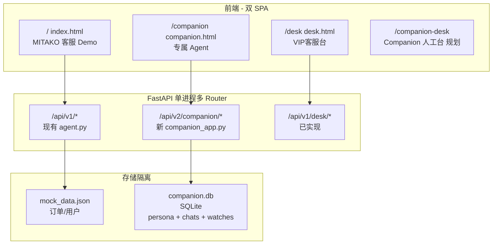

# Implementation Plan: Companion 专属 Agent 独立产品线

**Feature**: `005-companion-agent-platform`  
**Spec**: [spec.md](./spec.md)  
**Constitution**: `.specify/memory/constitution.md`（Companion 扩展原则见下文）

## Summary

在 **不改动现有 MITAKO 客服 Demo 行为** 的前提下，新建 `MITAKO_Companion/`（或 monorepo 子包）实现第二套移动端对话 + 独立 SQLite + 独立 API 前缀。客服 Demo 继续服务 `/` 与 `/desk`；Companion 服务 `/companion` 与未来的 `/companion-desk`。

## URL 路由表（已实现）

| 用户可见 URL | Vite 入口 | FastAPI 路由 | 说明 |
|-------------|-----------|--------------|------|
| `http://127.0.0.1:8001/` | `index.html` | `GET /` | 客服 C 端 |
| `http://127.0.0.1:8001/desk` | `desk.html` | `GET /desk` | VIP客服台 + **移交简报** |
| `http://127.0.0.1:8001/companion` | `companion.html` | `GET /companion` | Companion 专属 Agent |
| `http://127.0.0.1:8001/companion-desk` | `companion-desk.html` | `GET /companion-desk` | Companion 运营台占位 |

构建：`npm run build` 产出 `dist/companion.html` 等；Python 静态托管上述路径。

## Architecture



## Tech Stack

| 层 | 选择 | 说明 |
|----|------|------|
| Companion 前端 | React 18 + Vite + Tailwind + Zustand | 与客服 Demo 同栈，**不共享** `useChatSSE.js` |
| Companion 后端 | FastAPI router `companion_router` | 新文件 `companion_api.py`，挂载 `/api/v2/companion` |
| 持久化 | SQLite + SQLAlchemy 或 aiosqlite | Windows 友好，单文件易拷贝 |
| LLM | 复用 `llm_models.py` 配置 | **不修改** 已有 model_id 默认值 |
| 人格/安全 | System prompt 模板 + 本地敏感词表 | RP 允许情感表达，拦截违法/侮辱 |

## Repository Layout (建议)

```
MITAKO_Agent/                 # 现有客服 Demo（保持）
MITAKO_Companion/             # 新建独立目录（推荐）
  companion.html
  src/
    companion-main.jsx
    hooks/useCompanionChat.js # 简化 SSE，无 SOP 节点面板
    stores/personaStore.js
    pages/Onboarding.jsx
    pages/Chat.jsx
  companion_api.py              # 或放在 Agent 仓库 backend/companion/
  companion.db
  一键启动-Companion.bat
```

若坚持单仓库：使用 `packages/companion-ui` + `companion/` Python 包，Vite multi-page 增加 `companion.html`。

## Data Model (companion.db)

| 表 | 字段要点 |
|----|----------|
| `users` | id, display_name, member_tier, created_at |
| `personas` | user_id, agent_name, user_title, personality_json, birthday, avatar_theme |
| `conversations` | id, user_id, mode (`companion`/`cs_parttime`) |
| `messages` | conversation_id, role, content, created_at |
| `watch_orders` | user_id, order_ref, notify_flags |
| `watch_products` | user_id, product_query, price_alert |
| `wishlist_requests` | user_id, description, status |

## API Contracts (v2 草案)

| Method | Path | 用途 |
|--------|------|------|
| GET | `/api/v2/companion/persona/{user_id}` | 读取人格配置 |
| PUT | `/api/v2/companion/persona/{user_id}` | 更新名称/称谓/性格 |
| POST | `/api/v2/companion/chat` | SSE 对话（独立 history） |
| GET | `/api/v2/companion/messages` | 分页历史（cursor/limit） |
| POST | `/api/v2/companion/watch/order` | 绑定盯单 |
| GET | `/api/v2/companion/digest` | 离线摘要 |

## UI/UX 差异（Companion）

- 无 Agent Monitor 右栏（或改为「心情/关系度」轻面板）
- 气泡：Companion 专属渐变 + 「专属」角标（非 AI 客服角标）
- 非流式默认 + 底部 presence dock（复用交互模式，**新组件拷贝**）
- Onboarding 3 步：命名 → 称谓/性格 → 欢迎仪式

## Phased Delivery

### Phase A — 脚手架（1–2 天）
- [ ] 新建 `companion.html` + 空 Chat UI
- [ ] `companion.db` + persona CRUD
- [ ] 独立 SSE chat（20 轮稳定）

### Phase B — 人格与安全（2–3 天）
- [ ] Onboarding + 敏感词校验
- [ ] 多模板 system prompt（性格维度）
- [ ] 消息分页滑动窗口（复用模式，独立 hook）

### Phase C — 消费助理（3–5 天）
- [ ] watch_orders / mock 状态 push
- [ ] 查价 mock API
- [ ] wishlist_request 工单

### Phase D — 兼职客服 & 人工台（后续）
- [ ] `mode=cs_parttime` 子图
- [ ] `/companion-desk` 工作台

## Constitution Amendments (Companion 扩展)

对 `.specify/memory/constitution.md` 建议追加：

1. **双产品线隔离**：Companion 与客服 Demo 不得共享会话 state 或 DB 表。
2. **情感表达允许**：Companion 可表达喜爱与陪伴，但必须可审计、可开关、有 safety 拦截。
3. **RP 底线**：合法合规优先于用户即时满足。

## Test Plan

- [ ] `/` 与 `/companion` 同时打开，互不影响 sessionStorage
- [ ] Companion 20+ 轮对话无空白气泡
- [ ] 修改 Agent 名后刷新仍保留（SQLite）
- [ ] 侮辱性名称被拒绝
- [ ] `/desk` 仅显示客服转VIP客服队列，不含 Companion 会话

## Dependencies on Current Work (已完成)

- 客服 Demo：`revealAssistantMessage` 管线、`/desk` 工作台 v1、presence dock 交互模式 —— Companion **拷贝模式，不 import 客服 Hook**。
