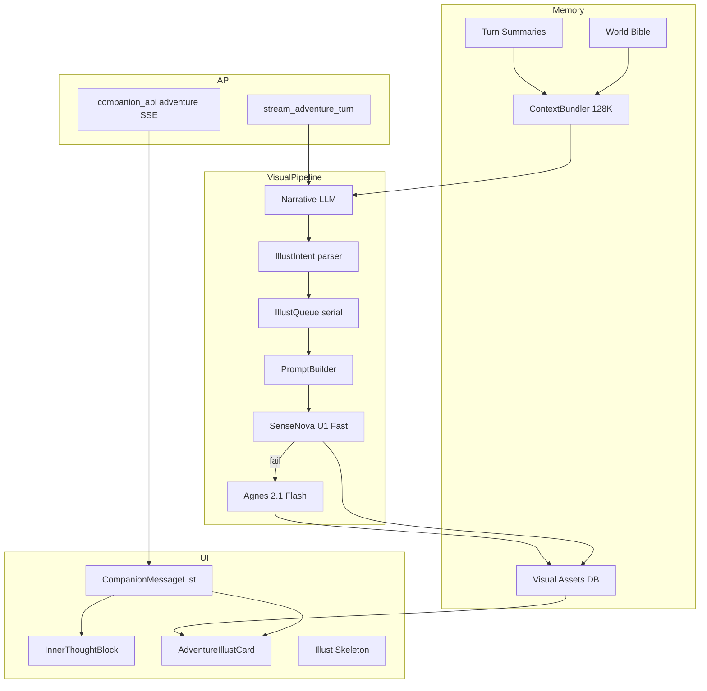

# Implementation Plan: 冒险模式视觉沉浸与配图系统

**Branch**: `006-adventure-visual-immersion` | **Date**: 2026-06-19 | **Spec**: [spec.md](./spec.md)

## Summary

在现有 Companion 冒险模式（`companion_adventure.py` + SSE 前端）上叠加三层能力：

1. **呈现层**：内心独白 `<inner>摘要|全文</inner>` 折叠 UI；配图消息卡 + Loading 占位。
2. **视觉管线层**：叙事 LLM 输出结构化意图 → Prompt Builder 生成 U1 信息图 prompt → 设定图/插图入库；Agnes fallback。
3. **会话智能层**：World Bible 锁定 + OOC 纠偏 + 128K 上下文压缩（摘要表 + token 估算）。

## Technical Context

**Language/Version**: Python 3.11+（FastAPI）、React 18 + Vite

**Primary Dependencies**: 现有 `image_service.py`（U1）、新增 `agnes_image_service.py`；httpx；SQLite（companion_store 扩展）

**Storage**: SQLite 表扩展 + 可选本地 `data/adventure_assets/` URL 缓存索引

**Testing**: pytest 单元（prompt builder、压缩器）+ Playwright E2E（内心折叠、配图占位）

**Target Platform**: Win11 本地 / 单进程部署（百万用户目标需后续 Redis 队列，v1 内存队列 + DB 状态）

**Performance Goals**: 配图占位 <500ms；U1 p95 <60s；同会话配图串行；128K token 预算

**Constraints**: 不改动用户已配模型名；i18n 全覆盖；单文件 ≤1000 行；U1 1500/5h quota

**Scale/Scope**: v1 单租户 demo + 可扩展 schema；Monitor 可观测

## Constitution Check

| 原则 | 符合性 | 说明 |
|------|--------|------|
| I SOP 优先 | N/A | Companion 冒险非客服 SOP |
| II 情绪+准确 | ✅ | 内心折叠 + 世界观纠偏 |
| III 移动端 | ✅ | 折叠 touch ≥44px；配图 responsive 16:9/3:4 |
| IV 模块化 | ✅ | 新模块 `companion_adventure_visual.py` 等拆分 |
| V 品牌 | ✅ | 冒险 violet 系，不用俗套紫粉渐变模板 |

**Gate**: PASS — 需在 UI 评审中确认配图卡与 Monitor 不破坏 PhoneFrame 层级。

## Project Structure

### Documentation (this feature)

```text
.specify/specs/006-adventure-visual-immersion/
├── spec.md
├── plan.md
├── research.md
├── data-model.md
├── quickstart.md
├── tasks.md
├── contracts/
│   └── adventure-visual-sse.md
└── checklists/requirements.md

docs/adventure/
└── image-prompt-playbook.md    # 生图 Prompt 工程 playbook（团队沉淀）
```

### Source Code (target)

```text
MITAKO_Agent/
├── companion_adventure.py          # 扩展 system prompt、illust 标记解析
├── companion_adventure_visual.py     # NEW: bible、prompt builder、配图队列
├── companion_adventure_context.py    # NEW: 128K 压缩与摘要
├── companion_richtext.py             # inner 标记规范
├── image_service.py                  # U1 封装（已有）
├── agnes_image_service.py            # NEW: Agnes 2.1 Flash fallback
├── image_models.py                   # 注册 agnes-image-2.1-flash
├── companion_store.py                # 扩展表
├── companion_api.py                  # SSE 事件 illust_*
├── prompts/
│   ├── adventure-narrative.md        # NEW: 叙事+illust+inner 规范
│   └── adventure-world-bible.md      # NEW: bible 生成模板
├── src/
│   ├── utils/formatText.js           # parseInnerThought
│   ├── components/adventure/
│   │   ├── InnerThoughtBlock.jsx     # NEW
│   │   └── AdventureIllustCard.jsx   # NEW
│   └── companion/hooks/useCompanionChat.js  # illust SSE
└── tests/
    ├── unit/test_adventure_visual.py
    └── e2e/test_adventure_illust.spec.ts
```

## Architecture



## Phase Breakdown

### Phase A — 富文本与内心交互（无生图）

- 定义 `<inner>摘要|正文</inner>` 语法（`|` 分隔，正文可含 `\n` 转义）
- `formatAdventureText` + `InnerThoughtBlock.jsx`
- 更新 `ADVENTURE_RICH_TEXT_RULES` 与 `build_adventure_system`

### Phase B — World Bible + OOC 纠偏

- 开局 LLM 生成 bible JSON → 存 `companion_adventure_bible`
- System prompt 注入 bible；纠偏 few-shot 写入 `adventure-narrative.md`

### Phase C — 视觉资产与 Prompt Builder

- 表 `companion_adventure_visual_assets`
- `PromptBuilder` 三类模板：character_sheet / scene_board / turn_illust
-  playbook 见 `docs/adventure/image-prompt-playbook.md`

### Phase D — 配图队列 + SSE + UI

- 后台 asyncio 任务：`illust_queued` → `illust_generating` → `illust_ready` | `illust_failed`
- 前端 `AdventureIllustCard` + shimmer
- Monitor 阶段日志

### Phase E — 上下文压缩

- `tiktoken` 或字符 heuristic 估算 token
- 超 100K 触发滚动摘要；保留最近 8 回合全文

### Phase F — Agnes Fallback + E2E

- `agnes_image_service.py`；`.env.example` 增加 `AGNES_API_KEY`
- E2E + quota 耗尽路径

## Configuration (.env)

```env
SENSENOVA_API_KEY=...
ADVENTURE_ILLUST_PRIMARY=sensenova-u1-fast
ADVENTURE_ILLUST_FALLBACK=agnes-image-2.1-flash
ADVENTURE_ILLUST_MAX_PER_SESSION=40
ADVENTURE_CONTEXT_TOKEN_BUDGET=128000
ADVENTURE_ILLUST_COOLDOWN_TURNS=2
```

## Risks & Mitigations

| 风险 | 缓解 |
|------|------|
| U1 不支持参考图输入 | 设定图 URL 写入 prompt 文字描述 + 色板 HEX 从 scene_board 提取 |
| CDN URL 过期 | 异步 mirror 到本地 static（v1.1） |
| 每回合生图烧 quota | LLM 显式 `<illust:scene>` + cooldown |
| 128K 估算不准 | 保守阈值 100K 触发摘要 + Monitor 暴露 token 估算 |

## Next Steps

1. 评审本 plan 与 [research.md](./research.md)
2. 执行 [tasks.md](./tasks.md) Phase A→F
3. `/speckit-analyze` 交叉检查后再编码
