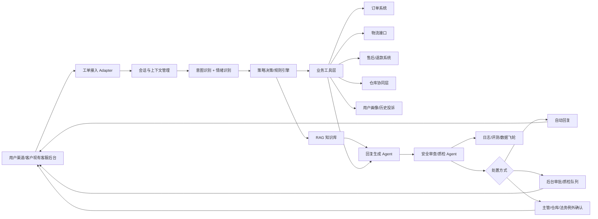

# 二次元电商客服 AI Agent 最终规划方案

更新时间：2026-06-11

## 0. 融合结论

本最终版综合了三份材料：

- 《二次元周边电商客服 Agent 建设规划方案》：优势在于业务判断清晰，强调“客服业务 Agent”而不是普通聊天机器人；MVP 场景、演示脚本、风险升级、仓库协同 Demo 设计很实用。
- 《二次元电商客服 AI_Agent 规划方案》：优势在于用户画像、人设、情绪价值、投诉策略、KPI、数据安全和持续优化机制更完整。
- 我之前的版本：优势在于 7 天 MVP + 30 天正式开发路线更可执行，技术架构、开源项目选型、自动化边界、后台审批和验收指标更稳。

最终建议采用“两阶段推进、AI 默认承接、例外审批兜底”的建设策略：

- 第一阶段：7 天内交付可试用 MVP Demo，证明 AI 能跑通“用户咨询 -> 意图识别 -> 查 SOP/订单/物流 -> 情绪安抚 -> 自动回复/工单处理 -> 例外审批”的完整链路。
- 第二阶段：30 天内完成生产级系统灰度上线，目标是让 AI 默认承接绝大多数一线客服工作，人工只在大额退款、企业内部灵活政策、法务/监管、重大舆情等例外场景做后台确认。
- 三层防线：规则引擎控制业务边界，LLM 负责理解和表达，后台审批只处理少数高风险动作；用户侧体验应尽量保持连续、统一、像一个高水平品牌客服。

需要对客户明确：目标不是“AI 辅助人工客服”，而是“AI 成为默认客服主体”。但系统仍不能让大模型自由决定大额退款、赔付、补偿或责任认定，这些必须通过后台规则和审批控制。

## 1. 项目背景

客户是一家二次元周边电商平台，现有客服团队约十几人，主要处理售后咨询和工单。平台用户以二次元消费者为主，对角色、款式、预售承诺、盲盒结果和发货时间有较强情绪投入，因此客服工作不只是回答问题，还承担情绪安抚、投诉降级和品牌关系维护的作用。

当前业务特征：

- 每日约 2,000 名用户发生客服触达或咨询。
- 每日形成约 200-300 个具体工单。
- 高频问题包括订单查询、物流查询、催发货、预售延期、预售取消、退款、退换货、盲盒投诉、商品破损、错发漏发、仓库核实、用户投诉等。
- 客户已有自建客服后台，可查看工单、状态、用户提交内容、图片和处理记录。
- 订单、快递信息部分可以通过第三方或内部接口查询。
- 仓库系统暂未与客服系统打通，退换货、补发、质检、入库确认等仍需人工沟通。

客户希望用 AI 替代现有客服团队，实现客服自动化、服务人格统一、用户情绪安抚和投诉风险降低。产品呈现上，建议用户侧统一展示为平台品牌客服，不在每次对话中主动强调“这是 AI 客服”，让体验重点落在响应速度、解决能力和情绪价值上。

## 2. 核心建设判断

本项目不能按“AI 聊天机器人”来做，而应按“客服业务 Agent 系统”来做。

普通机器人只会回答问题，无法真正替代客服团队。要替代大部分客服工作，系统必须具备：

- 理解用户真实意图。
- 识别用户情绪和投诉风险。
- 查询订单、物流、售后、工单状态。
- 检索客服 SOP、售后规则、预售规则、盲盒规则。
- 判断当前问题是否可以自动处理。
- 在权限范围内执行动作。
- 对大额退款、企业内部灵活政策、重大投诉、法务/监管等少数例外问题触发后台审批或主管确认。
- 用统一品牌人格与二次元用户沟通。
- 提供情绪价值，降低用户抱怨和社媒扩散风险。
- 将每次处理过程沉淀为可审计、可复盘、可优化的数据。

最终系统应成为“用户侧无感、后台可审计、动作可控、效果可灰度”的客服处理引擎，而不是一个无法解释的黑盒聊天窗口。

## 2.1 对外身份与体验策略

本项目的产品目标是让用户感受到“客服响应更快、态度更稳定、处理更专业”，而不是让用户感知自己正在被一个低成本机器人接待。因此建议：

- 用户侧统一展示为平台品牌客服账号、客服助手或品牌角色，不在开场白里主动声明“我是 AI 客服”。
- 回复风格要达到或超过优秀人工客服：更快、更稳、更会共情、更少犯错、更能持续跟进。
- 避免“机器人感”：不使用“根据我的程序”“我是 AI 无法处理”等表达。
- 避免冒充具体真人：不使用真实员工姓名、工号、个人身份，避免用户产生被真人一对一接待的误解。
- 对外可在服务协议、帮助中心或隐私政策中保留“平台可能使用智能客服系统提供服务”的合规披露入口；对话中不必每轮强调。
- 后台必须保留完整审计：用户消息、检索依据、工具调用、回复内容、审批动作、质检结果都可追溯。

## 3. 建设目标

### 3.1 功能替代目标

AI Agent 应覆盖以下核心客服能力：

- 订单查询：订单状态、付款状态、商品信息、预售/现货属性。
- 物流追踪：快递公司、运单号、物流轨迹、异常滞留、预计送达。
- 售后处理：退款、退货、换货、补发、破损、错发漏发。
- 预售问题：预售周期、延期原因、取消原因、补偿政策。
- 盲盒争议：随机规则解释、情绪承接、替代方案推荐。
- 工单处理：自动摘要、标签、状态更新、下一步动作。
- 仓库协同：生成仓库协同单，跟进入库、质检、补发、退件。
- 投诉处理：识别高风险措辞，安抚情绪，优先由 AI 稳定承接；仅在法务、监管、重大舆情或企业内部灵活政策场景升级后台主管确认。

### 3.2 人格统一目标

AI Agent 要形成稳定的品牌人格。建议定位为“懂二次元、情绪稳定、可靠温柔的客服伙伴”，而不是机械的“客服机器人”。

人格原则：

- 亲切、有温度，但不过度卖萌。
- 熟悉二次元语境，但不乱玩梗。
- 先共情，再解释，再给下一步。
- 不与用户争辩，不否定用户感受。
- 对无法满足的诉求，用替代方案降低失落感。
- 在规则和金额问题上保持清晰、克制、可追溯。

可配置资产：

- 品牌人格卡：名称、称呼方式、语气、禁用词、常用安抚句。
- 场景话术卡：物流延迟、预售延期、盲盒未中、商品破损、退款失败等。
- 风险话术卡：投诉升级、社媒曝光、辱骂、索赔、法务/监管风险。

### 3.3 情绪价值目标

二次元周边消费带有强烈情感投资属性。用户购买手办、徽章、盲盒、角色周边，本质上是在为喜爱的角色和“拥有感”付费。当预售延期、盲盒未中、商品瑕疵或发货异常发生时，用户的失望往往高于普通电商交易。

因此，AI 不只回答问题，还要做到：

- 识别情绪等级和投诉风险。
- 在解决问题前先承接情绪。
- 对盲盒、预售等高情绪场景给出“共情 + 规则 + 替代方案”。
- 避免机械拒绝、推责、复读 SOP。
- 降低社媒曝光、投诉升级和负面扩散。

## 4. 用户画像与核心场景

### 4.1 用户特征

二次元用户通常有以下特征：

- 情感投入高：对角色、款式、限定、预售承诺非常敏感。
- 对人设接受度高：更容易接受有一致人格的 AI 客服。
- 沟通偏好轻松：可接受适度语气词、表情包、圈层表达。
- 对敷衍敏感：模板化、推责式回复容易激化情绪。
- 对公平和规则敏感：盲盒概率、预售延期、补偿政策需要解释清楚。

### 4.2 服务场景优先级

| 场景类型 | 估算占比 | 复杂度 | 处理要点 | 自动化策略 |
| --- | ---: | --- | --- | --- |
| 订单/物流查询 | 30% | 低 | 信息准确、响应快、给预计时间 | 优先自动回复 |
| 退换货申请 | 25% | 中 | 规则校验、资料收集、仓库协同 | AI 自动推进，仓库/金额异常审批 |
| 商品咨询 | 15% | 低 | 库存、规格、预售/现货、搭配建议 | 可自动回复 |
| 投诉与不满 | 15% | 高 | 情绪安抚、风险识别、稳定承接 | AI 优先处理，重大风险后台审批 |
| 退款/售后 | 10% | 中高 | 金额、审批、到账确认 | AI 查询/解释/推进，小额自动，大额审批 |
| 其他 | 5% | 中 | 灵活判断 | AI 先承接，无法判定时进入异常队列 |

第一批自动化应优先覆盖订单/物流查询、商品咨询、普通规则咨询和工单进度查询；退款、补偿、投诉和仓库异常也应由 AI 先承接和推进，只把大额退款、超政策补偿、责任认定、法务/监管、重大舆情等少数动作送入后台审批。

## 5. 总体架构

### 5.1 系统分层

| 层级 | 模块 | 说明 |
| --- | --- | --- |
| 渠道接入层 | 客户现有客服后台、Web Chat、App、企微/飞书等 | 第一优先级接入客户现有后台，不轻易替换 |
| 数据接入层 | 工单、订单、物流、售后、仓库、用户画像 Adapter | 用统一接口封装不同系统 |
| 智能引擎层 | LLM、RAG、意图识别、情绪识别、对话管理 | 负责理解、检索、生成和上下文维护 |
| 业务逻辑层 | 规则引擎、权限控制、流程状态机、工具调用 | 控制可自动执行和必须审批的边界 |
| 呈现与运营层 | AI 工作台、SOP 管理、质检后台、监控报表 | 给客服主管和运营使用 |

### 5.2 核心数据流

1. 用户发起咨询，工单接入层获取用户消息、订单号、图片、历史记录。
2. 上下文管理模块聚合订单、物流、售后、用户画像和历史工单。
3. 意图识别和情绪识别并行运行，输出场景类型和风险等级。
4. 策略决策模块判断需要检索哪些 SOP、调用哪些工具、采用什么沟通风格。
5. Agent 基于 RAG 内容和工具结果生成回复。
6. 安全审查模块检查是否编造、是否越权、是否激化情绪、是否违反政策。
7. 系统默认自动发送或自动推进工单；仅在命中金额、法务、监管、企业内部灵活政策等硬规则时进入后台审批/例外确认队列。
8. 全链路写入日志，用于质检、评测和持续优化。

## 6. Agent 模块设计

| Agent 模块 | 作用 |
| --- | --- |
| 路由 Agent | 判断用户问题属于物流、订单、售后、投诉、商品咨询等 |
| 情绪识别 Agent | 判断情绪等级、投诉风险、是否有社媒/法务风险 |
| 身份/订单匹配 Agent | 识别用户、订单、商品、售后状态 |
| SOP 检索 Agent | 从知识库中找到适用规则和话术 |
| 业务判断 Agent | 判断是否符合售后规则、是否可自动处理 |
| 工具调用 Agent | 调用订单、物流、售后、仓库、工单接口 |
| 回复生成 Agent | 按品牌人格生成用户回复 |
| 工单处理 Agent | 自动写摘要、标签、状态和下一步动作 |
| 质检 Agent | 检查回复是否越权、编造、违规或语气不当 |
| 升级 Agent | 判断是否需要主管、仓库、财务、法务或售后审批 |

正式版推荐用 LangGraph 或自研状态机承载这些模块。MVP 可以用 Dify/Flowise/MaxKB 的工作流能力先跑通。

## 7. 自动化边界

### 7.1 AI 可自动回复并自动推进

- 纯订单/物流查询，且系统查询结果明确。
- 普通商品咨询、库存/规格/预售周期解释。
- 普通 SOP/FAQ 问答。
- 工单进度查询。
- 资料补充提醒。
- 售后流程说明，不涉及金额承诺。
- 低金额、规则明确的退款进度查询和售后状态推进。
- 退换货资料收集、图片举证引导、仓库协同单生成。
- 物流异常解释和跟进承诺。
- 预售延期说明、情绪安抚、下一步跟进。
- 普通投诉安抚和工单升级记录。

### 7.2 AI 持续服务，但动作需后台审批

这些场景不应直接“转人工聊天”，而应由 AI 继续接待用户，同时在后台发起审批、确认或协同。用户体验上仍然是一个连续客服在处理。

- 大额退款、大额补偿、赔付。
- 超出公开 SOP 的灵活处理政策。
- 平台责任认定、争议责任归属。
- VIP/KOL/高金额订单的特殊处理。
- 仓库质检结果不明确、库存异常、补发资源不足。
- 用户威胁投诉、曝光、报警、起诉，需要主管/法务确认口径。
- 系统数据冲突或关键接口不可用。

### 7.3 AI 应拒绝自动承诺的事项

- 承诺具体大额退款或赔付金额。
- 承诺无法由系统确认的发货日期、补发日期、到账日期。
- 承诺破例处理、特殊权益、额外补偿。
- 代表公司认定法律责任或平台责任。
- 泄露内部灵活政策、仓库内部处理信息或其他用户信息。
- 在 SOP 缺失时编造规则。

### 7.4 资金和补偿权限建议

| 动作 | 建议权限 |
| --- | --- |
| 查询退款进度 | AI 可自动 |
| 解释退款规则 | AI 可自动，但必须引用 SOP |
| 10 元以内优惠券/积分补偿 | 可灰度开放，需后台硬限制 |
| 10-100 元补偿 | 主管审批 |
| 100 元以上退款/赔付 | 多级审批 |
| 修改订单金额/库存/发货状态 | 不建议 AI 自动执行 |

## 8. 情绪与投诉处理体系

### 8.1 情绪分级

| 等级 | 用户状态 | AI 策略 |
| --- | --- | --- |
| L1 愉悦/普通 | 正常咨询、表达满意 | 高效解决，可适度推荐活动 |
| L2 平静 | 情绪稳定，问题明确 | 按标准流程处理 |
| L3 焦虑/轻度不满 | 催促、担心、失望 | 先安抚，再缩短解决路径 |
| L4 愤怒/投诉 | 激烈措辞、反复质问 | AI 强共情、给明确动作，后台标记重点跟进 |
| L5 高风险 | 曝光、投诉、报警、起诉、监管 | AI 稳定承接，停止越权承诺，后台主管/法务确认 |
| L6 恶意攻击 | 辱骂、诱导越权、提示词注入 | 稳定回应，必要时终止自动处理 |

情绪识别信号包括文本语义、标点和语气、消息频率、重复追问、历史投诉、会员等级、订单金额、商品类型等。

### 8.2 投诉处理矩阵

| 投诉类型 | 策略 | 关键动作 |
| --- | --- | --- |
| 物流延迟 | 解释 + 跟进 + 可选补偿 | 查询实时轨迹，说明原因，给下一次更新时间 |
| 预售延期 | 共情 + 规则 + 时间线 | 解释预售机制，说明最新预计节点，避免空泛保证 |
| 预售取消 | 道歉 + 原因 + 方案 | 说明取消原因、退款/补偿政策，必要时升级 |
| 商品质量 | 确认 + 举证 + 退换/补发 | 引导上传图片，生成售后/仓库协同单 |
| 错发漏发 | 查单 + 核实 + 补救 | 查询订单和出库记录，生成仓库核实单 |
| 盲盒不满 | 共情 + 规则 + 替代 | 承认失落感，解释随机规则，提供替代方案 |
| 客服体验 | 道歉 + 记录 + 回访 | 生成主管跟进摘要，后台重点跟进 |
| 社媒曝光/法务 | 稳定 + 停止承诺 + 升级 | 转主管/法务，不争辩，不刺激 |

### 8.3 标准回复结构

建议回复遵循“四段式”，但表达要自然：

1. 共情确认：承认用户等待、失望或不满。
2. 事实同步：基于订单、物流、SOP 给出当前事实。
3. 明确下一步：说明系统已做什么、还需要用户做什么、多久反馈。
4. 温和收束：承诺跟进，降低焦虑。

## 9. 人格与沟通风格

### 9.1 人格定位

建议将 AI Agent 定位为“可靠、温柔、懂二次元的售后伙伴”。是否给具体名字和头像，可由客户品牌决定。若要强化品牌记忆，可设计二到三个字的角色名和 Q 版头像，但要避免过度拟人化导致用户误认为真人。

核心性格：

- 热情友好。
- 耐心细致。
- 懂二次元语境。
- 专业可靠。
- 情绪稳定。

### 9.2 场景化风格切换

| 风格模式 | 适用场景 | 语言特征 |
| --- | --- | --- |
| 轻活泼 | 日常咨询、查物流、问库存 | 简洁明了，可少量使用“啦”“呢”“~” |
| 温柔共情 | 投诉、不满、预售延期、盲盒失落 | 先处理情绪，再处理问题 |
| 清晰严谨 | 退款、规则、金额、责任边界 | 条理清楚，避免含糊承诺 |

建议可用表达：

- “这边帮你查到啦。”
- “让你久等真的不好意思。”
- “我先帮你把这件事记录并跟进。”
- “这个情况确实会让人失落，我理解你的心情。”

不建议使用：

- 过度卖萌或大量颜文字。
- “亲亲”“宝子”等不一定符合品牌的称呼，除非客户明确要求。
- 没依据的补偿承诺。
- “规则就是这样”这类容易激化情绪的表达。
- 与用户争论盲盒或预售规则是否合理。

## 10. 知识库与数据建设

### 10.1 客户需提供的数据

- 最近 1-3 个月历史工单，建议至少 1,000 条，脱敏后使用。
- 完整 SOP、FAQ、售后政策、退款规则、物流政策。
- 预售规则、盲盒规则、定金/尾款规则、瑕疵判定标准。
- 商品类型、活动说明、特殊商品限制。
- 客服优秀回复样本和差评样本。
- 订单系统、物流系统、售后系统、仓库系统接口文档。
- 投诉升级案例和处理结果。

### 10.2 知识库结构

| 知识类别 | 内容 |
| --- | --- |
| policy | 平台规则、退款规则、售后政策 |
| sop | 客服处理步骤、审批流程 |
| template | 场景话术、安抚话术、例外审批话术 |
| product | 商品、活动、预售、盲盒信息 |
| case | 历史优秀工单、投诉案例 |
| risk | 高风险场景、禁用承诺、法务边界 |

每条知识建议包含标题、正文、适用场景、适用商品/活动、版本号、生效时间、失效时间、负责人。

### 10.3 标注字段

历史工单最小标注字段：

- 意图分类。
- 情绪等级。
- 是否可自动回复。
- 正确处理动作。
- 标准回复或优秀人工回复。
- 是否涉及退款、仓库、物流异常。
- 是否发生投诉升级。
- AI 处理建议是否可采纳。

## 11. 7 天 MVP 方案

### 11.1 MVP 定位

MVP 的目标不是上线生产系统，而是在 7 天内做出一个客户可以直接体验的 Demo，让客户明确感受到：

- AI 能听懂二次元周边用户的问题。
- AI 能识别订单、物流、预售、退款、盲盒、投诉等场景。
- AI 能用符合品牌人格的语气回复。
- AI 能根据 SOP 给出相对准确的处理建议。
- AI 能识别用户情绪并进行安抚。
- AI 能模拟调用订单、物流、工单、仓库协同等工具。
- AI 能生成工单摘要、标签和下一步动作。

MVP 不追求所有真实系统打通，但必须让客户看到完整业务链路。

### 11.2 MVP 演示场景

| 场景 | 用户问题 | Demo 展示能力 |
| --- | --- | --- |
| 查物流/催发货 | “我的东西怎么还没到？” | 查询订单状态、调用物流、解释当前卡点 |
| 预售延期投诉 | “预售这么久还不发，是不是骗人？” | 识别预售规则、安抚情绪、给下一步 |
| 退款/退换货 | “我想退款/这个有瑕疵” | 引导提交材料、判断规则、生成售后工单 |
| 盲盒未中心仪款 | “没抽到我要的，必须退钱” | 承接情绪、解释盲盒规则、避免激化 |
| 高风险投诉 | “我要曝光你们/去投诉” | 识别高风险、停止自动承诺、升级主管 |
| 错发/破损 | “收到的东西坏了/发错了” | 引导上传图片，生成仓库协同单 |

### 11.3 MVP 功能范围

- 用户聊天体验界面：支持连续对话、订单号输入、图片上传模拟、多轮追问。
- AI 客服人格 Demo：展示轻活泼、温柔共情、清晰严谨三种风格。
- SOP 知识库 Demo：导入售后规则、预售说明、盲盒规则、常见 FAQ。
- 模拟订单/物流/售后数据：用于展示工具调用链路。
- 工单处理后台 Demo：展示工单列表、AI 建议回复、标签、风险等级、摘要。
- 情绪识别与投诉风险 Demo：识别普通咨询、轻度不满、明显愤怒、威胁投诉、法务风险。
- 仓库协同 Demo：模拟生成仓库协同单，包括问题类型、订单、图片、建议动作、处理状态。

### 11.4 7 天排期

| 天数 | 重点 | 交付物 |
| --- | --- | --- |
| Day 1 | 需求收敛、场景清单、数据准备 | 20-30 个场景、风险边界、接口清单 |
| Day 2 | SOP 清洗、知识库、人设 prompt | 可检索知识库、人格卡、话术卡 |
| Day 3 | 工单 Demo、模拟订单/物流/仓库数据 | 工单读取/回写模拟、查询工具 |
| Day 4 | Agent 工作流 | 分类、检索、工具调用、回复、风险判断 |
| Day 5 | 历史工单回放与调优 | 测试报告、失败案例、prompt 修正 |
| Day 6 | Demo 后台和演示链路 | 工单列表、AI 处理结果、风险标签、日志 |
| Day 7 | 联调、演示、验收 | Demo 环境、演示脚本、下一阶段计划 |

### 11.5 MVP 技术路线

建议路线：

- Dify 或 Flowise 快速搭建 Chatflow/Workflow。
- MaxKB 可作为 SOP 知识库 Demo 备选，尤其适合中文企业知识库。
- 使用模拟订单、物流、售后、仓库数据代替真实接口。
- 用一个轻量 Web 页面或客户后台嵌入页展示工单、AI 处理结果和例外审批状态。
- 观测可先用 Dify 内置日志，或接入 Langfuse 做基础追踪。

MVP 重点不是技术炫技，而是把“用户咨询 -> AI 理解 -> 查数据 -> 查 SOP -> 情绪安抚 -> 生成回复 -> 更新工单 -> 例外事项后台审批”的链路跑通。

## 12. 30 天正式开发计划

### 第 1 周：生产接入与安全边界

目标：完成客户后台和核心业务数据的生产级接入。

- 对接客户客服后台：工单读取、消息回写、状态更新、标签更新。
- 对接订单、物流、售后状态查询。
- 建立工具权限：只读、低风险可写、需后台审批。
- 建立自动处理白名单、审批规则和拒绝越权承诺规则。
- 建立日志、审计、异常告警。

验收：

- AI 可读取真实工单、生成并发送符合规则的回复，后台记录完整处理链路。
- 订单/物流查询链路稳定。
- 只读查询和低风险动作可小范围自动处理；高风险动作只卡审批，不打断用户侧连续服务。

### 第 2 周：售后流程与仓库协同

目标：把退换货、破损、错发漏发从“人工口头沟通”变成结构化流程。

- 建立售后流程状态机：资料待补充、待规则判断、待仓库确认、待审批、已处理。
- 生成仓库协同单：订单、商品、问题、图片、建议动作。
- 短期用中间表、Webhook、飞书/企微、n8n 流程桥接仓库。
- 长期预留仓库 API 接入。
- 支持图片举证辅助识别，先作为后台质检和仓库判断参考。

验收：

- AI 能把退换货工单推进到明确状态。
- 仓库问题不再依赖客服手工描述。

### 第 3 周：人格、情绪与质检

目标：让 AI 回复从“能答”变成“像品牌客服一样答”。

- 建立二次元沟通风格语料库。
- 完善情绪识别和投诉风险模型。
- 增加回复前质检：政策一致性、越权承诺、情绪刺激、敏感信息泄露。
- 建立客服主管质检台：抽样、打分、标注、回归测试。
- 对投诉类会话 100% 复核。

验收：

- 语气合格率 90% 以上。
- 高风险问题后台识别召回优先保证，宁可多进审批队列，不让 AI 越权承诺。

### 第 4 周：灰度上线与运营闭环

目标：进入真实生产灰度，建立可持续运营机制。

- 按场景灰度：物流/规则咨询 -> 商品咨询 -> 售后自动推进 -> 投诉安抚自动承接。
- 按比例灰度：10% -> 30% -> 60% -> 80%。
- 建立日报：处理量、自动回复率、自动处理率、后台审批率、CSAT、投诉升级率、平均响应时间、成本。
- 建立知识库更新流程：SOP 变更后重建索引并跑回归测试。
- 设定两周生产观察期，原客服团队转为 AI 训练师、质检员、审批员和异常处理员，不再作为默认一线接待。

验收：

- 高频低风险问题自动化率达到 70%-90%。
- 整体一线人工接待工作量下降 70%-85%。
- 严重投诉和错误承诺可追溯、可回滚。

## 13. 正式版技术选型

### 13.1 推荐主架构

| 模块 | 推荐项目/方案 | 用途 | 备注 |
| --- | --- | --- | --- |
| Agent 编排 | LangGraph / 自研状态机 | 多步骤、可中断、可后台审批流程 | 正式系统主推 |
| MVP 原型 | Dify | 快速搭建 RAG、工作流、工具调用 | 适合 7 天 Demo |
| 知识库/RAG | Qdrant 或 MaxKB | SOP、FAQ、历史工单检索 | MaxKB GPLv3，商用交付需评估 |
| LLM 网关 | LiteLLM | 统一模型、成本、限流、负载均衡 | 适合多模型策略 |
| 客服台参考 | Chatwoot | 会话、工单、坐席台参考 | 现有后台弱时可二开 |
| 工作流集成 | n8n / 自研 webhook service | 仓库、飞书/企微、邮件、Webhook | n8n 授权需核对 |
| 观测与质检 | Langfuse | tracing、prompt、eval、数据集 | 建议正式版接入 |
| RAG 评测 | Ragas | 知识库问答回归测试 | 上线前回放验证 |
| 工具标准化 | MCP / Function Calling | 订单、物流、仓库工具标准化 | 可逐步引入 |

### 13.2 不同阶段的建议

MVP：

- Dify/Flowise/MaxKB + 模拟数据 + 简单 Web Chat + 简化工单后台。
- 目标是演示完整链路和人格效果。

正式版：

- 自研客服 Agent 后端 + LangGraph 状态机 + 结构化 SOP + 规则引擎 + 客户现有后台接口 + LLM 质检 + 后台审批机制。
- 低代码工具可用于内部运营和快速配置，但不建议作为所有生产核心逻辑的唯一底座。

### 13.3 开源项目适配判断

| 项目 | 适配度 | 建议用法 | 风险 |
| --- | --- | --- | --- |
| Dify | 高 | 7 天 MVP，部分工作流和知识库原型 | Dify Open Source License 基于 Apache 2.0 但有附加条件，商用前需复核 |
| LangGraph | 高 | 正式版核心编排 | 需要工程开发能力 |
| Qdrant | 高 | 生产向量库 | 需做好文档版本和过滤策略 |
| MaxKB | 中高 | 中文 SOP 知识库、内部原型 | GPLv3，二开/分发/商用交付需谨慎 |
| Chatwoot | 中 | 客服台参考或替代坐席台 | 若客户现有后台成熟，不建议整体替换 |
| Flowise | 中 | 内部原型和可视化流程 | 生产部署需安全加固，避免公网暴露 |
| Botpress | 中 | 对话设计和流程配置参考 | 深度私有化复杂业务仍建议自研 |
| n8n | 中高 | 仓库协同和运营自动化 | 非传统宽松开源，授权需核对 |
| Langfuse | 高 | 观测、评测、prompt 管理 | 企业功能边界需核对 |
| LiteLLM | 高 | 模型网关、成本控制 | 企业功能和 license 边界需核对 |

## 14. 数据安全与风控

### 14.1 数据安全

- 用户姓名、手机号、地址、支付信息必须脱敏存储和日志记录。
- 所有系统间传输使用 TLS。
- LLM 调用需要确认供应商数据处理政策，确保用户数据不会被用于模型训练。
- 敏感操作增加身份验证，例如短信验证码或后台登录态校验。
- 生产日志遵循最小必要原则，不记录完整隐私字段。

### 14.2 内容风控

输入侧：

- 检测提示词注入、恶意攻击、违法违规内容、极端表达。

输出侧：

- 检查是否编造政策、错误引用物流信息、越权补偿、泄露隐私、贬低竞品。

业务红线：

- 不得承诺超出权限的退款金额。
- 不得承诺无法保证的发货日期。
- 不得泄露其他用户信息。
- 不得认定平台责任或法律责任。
- 不得对未查证的仓库/物流状态做确定性判断。
- 不建议在用户对话开场主动强调 AI 身份，但应在服务协议、帮助中心或隐私政策中预留智能系统辅助服务的说明，具体披露方式需结合客户法务和上线地区合规要求确认。

## 15. 监控、评测与持续优化

### 15.1 核心 KPI

| 维度 | 指标 | MVP 目标 | 正式版目标 |
| --- | --- | ---: | ---: |
| 效率 | 平均首响时间 | < 5 秒 | < 3 秒 |
| 效率 | 工单平均处理时长 | 可展示链路 | < 5 分钟，按场景统计 |
| 质量 | 意图识别准确率 | > 85% | > 95% |
| 质量 | 回复事实错误率 | < 5% | < 2% |
| 质量 | 政策越权承诺 | 0 | 0 |
| 体验 | 语气合格率 | > 80% | > 90% |
| 体验 | 用户满意度 | 收集反馈 | 高于人工基线 |
| 风控 | 高风险后台识别召回 | > 90% | > 98% |
| 风控 | 越权动作拦截率 | > 95% | > 99% |
| 成本 | 一线人工接待工作量下降 | 可估算 | 70%-85% |
| 自动化 | 高频低风险自动化率 | 20%-40% | 70%-90% |
| 自动化 | 整体工单 AI 自动承接率 | 可展示 | 80%+ |
| 运营 | 后台审批率 | 可展示 | 控制在 5%-15% |

### 15.2 评测体系

- 历史工单回放：MVP 至少 100 条，正式版至少 1,000 条。
- 场景集：物流、退款、退换货、预售、盲盒、投诉、仓库异常。
- 自动评分：意图是否正确、SOP 是否命中、工具是否调用正确、回复是否越权。
- 后台质检：每周抽样，投诉类和审批类 100% 复核。
- 回归测试：每次 SOP 更新、prompt 更新、模型切换后必须跑。

### 15.3 数据飞轮

建立“交互 -> 质检 -> 标注 -> 知识库/规则/prompt 更新 -> 回归测试 -> 灰度发布”的闭环。

建议节奏：

- 每周更新知识库。
- 每周复盘失败案例。
- 每月优化 prompt 和规则。
- 每季度评估是否需要轻量微调或更换模型。

## 16. MVP 演示脚本

### 脚本 1：普通用户查物流

用户：“我的东西怎么还没到？”

展示点：

- AI 识别为物流查询。
- 要求或识别订单号。
- 调用订单和物流数据。
- 给出当前物流节点、可能原因、预计下一步。
- 自动更新工单摘要。

### 脚本 2：预售延期用户不满

用户：“预售这么久还不发，是不是骗人？”

展示点：

- AI 识别预售延期和不满情绪。
- 先安抚，再解释预售周期和延期原因。
- 给出明确下一步和预计反馈时间。
- 若延期超过阈值，AI 继续安抚和解释，同时后台生成主管确认事项。

### 脚本 3：盲盒未中心仪款投诉

用户：“我买了 10 个都没抽到我推，必须退钱。”

展示点：

- AI 承接失落感。
- 温和解释盲盒随机规则和售后边界。
- 不直接承诺退款。
- 提供替代方案，例如未拆封售后路径、换购/交换信息、后续活动提醒。

### 脚本 4：商品破损/错发

用户：“收到的徽章坏了，你们怎么回事？”

展示点：

- AI 识别质量/错发场景和情绪。
- 引导上传图片。
- 生成售后工单和仓库协同单。
- 给出处理时效和跟进承诺。

### 脚本 5：高风险投诉曝光

用户：“你们不处理我就发微博曝光，还要投诉。”

展示点：

- AI 识别高风险。
- 不争辩，不越权承诺。
- 稳定安抚并生成主管/法务后台确认单。
- 后台显示风险标签、摘要和建议处理动作。

## 17. 团队配置

7 天 MVP 最小配置：

- 1 名后端/Agent 工程师。
- 1 名前端或全栈工程师。
- 1 名产品/实施，负责 SOP、话术、客户沟通。
- 客户侧 1 名客服主管，负责样本和验收。

30 天正式版建议：

- 1 名技术负责人。
- 2 名后端/Agent 工程师。
- 1 名前端工程师。
- 1 名测试/质检。
- 1 名产品/实施。
- 客户侧客服主管、后台接口负责人、仓库系统负责人各 1 名。

## 18. 给客户的建议表述

建议这样表达：

“我们建议项目分为两个阶段推进。第一阶段用 7 天做一个可体验的客服 Agent Demo。这个 Demo 不是简单聊天机器人，而是会模拟完整客服业务链路：用户提问、系统判断意图、查询订单/物流、检索 SOP、安抚情绪、生成回复、更新工单、判断是否需要后台审批。客户可以直接用真实场景测试它的能力。”

“第二阶段进入正式系统开发，30 天内完成可灰度上线的客服 Agent 系统。正式系统会接入客户现有客服后台、订单系统、物流接口、售后流程和仓库协同流程，实现从自动回复到自动处理工单的升级。用户侧由统一品牌客服连续承接，不主动强调 AI 身份；后台保留必要审批和风控机制，原人工角色从一线对话接待转为异常处理、质检、审批和策略维护。”

“最终目标是让客服 Agent 承担绝大多数日常客服处理工作，服务体验超过普通人工客服：响应更快、情绪更稳定、口径更统一、跟进更持续，同时将客服数据反向沉淀为商品、供应链和售后体验优化的数据资产。”

不建议这样承诺：

- 7 天内完全替代十几个客服。
- AI 100% 自动处理所有退款、赔付、法务、监管和企业内部灵活政策。
- 没有仓库和客服接口支持的情况下完成全自动退换货。
- 让 AI 自由决定退款、赔付和责任认定。

## 19. 下一步行动清单

1. 向客户索要 SOP、FAQ、历史工单、订单/物流/售后/仓库接口文档。
2. 选 30 个典型场景，标注“自动回复/自动处理/后台审批/禁止承诺”。
3. 让客服主管提供 50 条优秀回复和 30 条投诉升级案例。
4. 确认客服后台 API 是否支持工单读取、消息回写、状态更新、标签更新。
5. 确认仓库系统短期能否通过 API、Webhook、中间表、飞书/企微或 n8n 打通。
6. 搭建 MVP：Dify/Flowise/MaxKB + 模拟数据 + 简易工单后台。
7. 用 100 条历史工单回放，修正 prompt、知识库和风险规则。
8. 第 7 天进行客户演示，并锁定正式版开发范围和灰度策略。

## 20. 调研来源

- Chatwoot：开源客服平台，支持多渠道会话和客服工作台参考。https://github.com/chatwoot/chatwoot
- Dify：LLM 应用开发平台，支持 workflow、RAG、Agent、模型管理和观测；其 license 基于 Apache 2.0 但有附加条件。https://github.com/langgenius/dify
- LangGraph：面向有状态、长流程、human-in-the-loop Agent 的编排框架。https://docs.langchain.com/oss/python/langgraph/overview
- Qdrant：向量数据库，Apache-2.0 license。https://github.com/qdrant/qdrant
- MaxKB：企业级智能体和知识库平台，支持 RAG、workflow、MCP tool-use，GPLv3 license。https://github.com/1Panel-dev/MaxKB
- Flowise：可视化构建 AI Agent，Apache License 2.0；生产部署需关注安全加固和版本更新。https://github.com/FlowiseAI/Flowise
- Botpress：LLM Agent / chatbot 开发平台，MIT license。https://github.com/botpress/botpress
- LiteLLM：AI Gateway，统一调用多家模型并支持成本、限流、guardrails、负载均衡。https://github.com/BerriAI/litellm
- Langfuse：LLM 观测、评测、prompt 管理和数据集平台。https://github.com/langfuse/langfuse
- n8n：workflow automation 平台，适合仓库和运营系统桥接。https://github.com/n8n-io/n8n
- Ragas：RAG/LLM 应用评测工具。https://github.com/explodinggradients/ragas
- Crawl4AI：面向 LLM 的网页抓取和抽取工具。https://github.com/unclecode/crawl4ai
- Flowise 安全提醒：2026 年公开报道显示旧版 Flowise 漏洞存在被利用风险，若用于生产应升级、鉴权、内网隔离。https://www.techradar.com/pro/security/top-open-source-ai-platform-flowise-hit-by-maximum-level-security-issue
