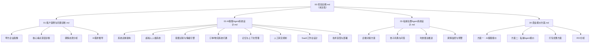
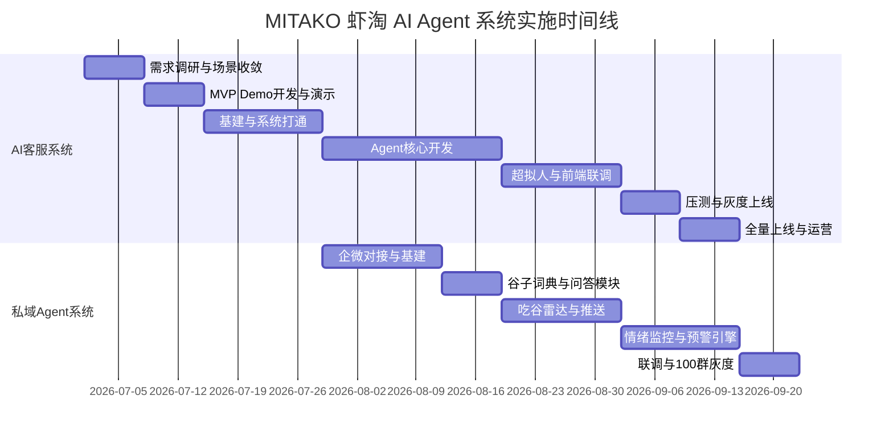

# MITAKO 虾淘 AI Agent 系统 —— 项目总纲

> **版本**: v2.0  
> **日期**: 2026-06-13  
> **状态**: 设计阶段  
> **编制**: 乙方 AI Agent 解决方案团队  
> **甲方**: 上海弹好团科技有限公司（MITAKO 虾淘）

---

## 项目概述

本项目为 MITAKO 虾淘（二次元动漫周边电商平台）提供两套完整的 AI Agent 商业化解决方案：

| 方案 | 定位 | 核心价值 | 年费目标 |
| --- | --- | --- | ---: |
| **AI 智能客服 Agent 系统** | 替代80%一线外包客服 | 从100万/年降至50万/年 | 50万 |
| **私域社群 AI 运营 Agent 系统** | 激活百万私域流量 + 舆情阻断 | 提升复购 + 危机防控 | 35-40万 |

**联合实施目标**: 两套系统合计年费 85-90 万，为甲方节省客服成本的同时，创造新的私域营销价值。

---

## 文档体系

本项目遵循 [Spec-Kit](https://github.com/github/spec-kit) 规范，文档体系如下：

### 文档索引

| 编号 | 文档名 | 内容概述 | 目标读者 |
| ---: | --- | --- | --- |
| 00 | [项目总纲](00-项目总纲.md) | 项目全局索引、商业摘要、文档体系 | 全员 |
| 01 | [客户案例与问题诊断](01-客户案例与问题诊断.md) | 甲方痛点深度分析、投诉案例、需求推导 | 产品/商务 |
| 02 | [AI客服Agent系统设计](02-AI客服Agent系统设计.md) | 核心客服系统完整技术设计文档 | CTO/架构/开发 |
| 03 | [私域社群Agent系统设计](03-私域社群Agent系统设计.md) | 私域运营Agent完整技术设计文档 | CTO/架构/开发 |
| 04 | [商业报价方案](04-商业报价方案.md) | 两套系统完整商业报价与ROI | 商务/甲方决策层 |

---

## 技术选型摘要

| 模块 | 选型 | 理由 |
| --- | --- | --- |
| 主力 LLM | Qwen3.5-Flash | 中文理解强、速度快、成本低 |
| 多模态 LLM | Doubao-Seed-2.0-Lite / Gemini-3.1-Flash-Lite | 图片理解（瑕疵检测）+ 音频理解（语音催单） |
| Agent 编排 | LangGraph (Python) | 状态机工作流，支持人工审批中断 |
| LLM 网关 | LiteLLM | 多模型路由、成本控制、限流 |
| 记忆系统 | OpenViking | 上下文虚拟文件系统，支持 L0/L1/L2 自动分层加载，极大地节省 Token 与降低延迟 |
| 人工工作台 | Chatwoot (开源二开) | 多渠道会话、工单流转、AI↔人工无缝切换 |
| 知识库 / RAG | Qdrant + MaxKB | 向量检索 + 中文 SOP 知识库管理 |
| 表情包引擎 | 自建 Meme Vector DB (Qdrant) | 二次元表情包标签化检索 |
| 观测与质检 | Langfuse | tracing、评测、prompt 管理 |
| 消息队列 | RabbitMQ | 私域万群消息洪峰处理 |
| 后端框架 | Go (高性能接入与API) + Python FastAPI (LangGraph) | Go 负责万群高并发回调与业务数据安全，Python 负责 Agent 工作流的高效迭代 |
| 数据库 | PostgreSQL + SQLite (本地缓存) | 主数据库 + 轻量本地存储 |

---

## 实施时间线概览

---

## 核心设计原则

### 1. AI 默认承接，人工例外审批
系统目标不是"AI辅助人工"，而是"AI成为默认客服主体"。人工仅在大额退款、法务/监管、重大舆情等少数场景做后台确认。

### 2. 超拟人 > 超智能
用户需要的不是一个全知全能的AI，而是一个"懂二次元、有同理心、会发表情包"的客服伙伴。情绪价值的优先级高于信息准确性。

### 3. 情绪第一，事实第二
在任何场景下，AI 必须先承接用户情绪（共情、道歉、安抚），然后再同步事实信息和解决方案。

### 4. 安全边界清晰
AI 绝不越权承诺退款金额、发货日期、特殊补偿。所有涉及资金流转的操作必须经过后台审批。

### 5. 数据飞轮驱动
每次对话都是优化的素材。建立"对话 → 质检 → 标注 → 知识库更新 → 回归测试 → 灰度发布"的持续改进闭环。

---

## 关键联系人需求

### 甲方需配合提供
- [ ] 客服主管 × 1（负责 SOP 提供与验收）
- [ ] 后台接口负责人 × 1（负责订单/物流/售后 API）
- [ ] 仓库系统负责人 × 1（负责退换货流程对接）
- [ ] 企微管理员 × 1（负责私域群管权限配置）
- [ ] 最近1-3个月历史工单（至少1000条，脱敏后使用）
- [ ] 完整 SOP/FAQ/售后政策/退款规则/物流政策
- [ ] 预售规则/盲盒规则/定金规则
- [ ] 客服优秀回复样本 50 条 + 投诉升级案例 30 条
