# MITAKO虾淘客户案例诊断与AI客服需求分析报告

> **文档编号**：CS-DIAG-001  
> **版本**：v1.0  
> **编制日期**：2026-06-13  
> **密级**：商业机密 — 仅限项目组内部  
> **信息来源**：南方都市报（2025-03-20）、人民网上海频道（2025-03-19）、黑猫投诉、消费保、App Store、天眼查、中国裁判文书网

---

## 1. 甲方企业画像

### 1.1 公司基本信息

| 维度 | 信息 |
|------|------|
| **平台名称** | MITAKO虾淘 |
| **运营主体** | 上海弹好团科技有限公司 |
| **注册地** | 上海市 |
| **产品形态** | iOS/Android App + 微信小程序 |
| **用户端占比** | App ≈ 60%，小程序 ≈ 35%，其他 ≈ 5% |
| **App Store评分** | 4.0/5（累计3,936个评分） |
| **年龄分级** | 18+（涉及虚拟抽卡/盲盒消费） |
| **私域规模** | 10,000+ 企微大群（覆盖约100万用户） |
| **客服年度预算** | ≈ 100万元（外包模式，单人3,000~5,000元/月） |
| **日均发货量** | ≈ 10,000单（2025年春节后数据） |

### 1.2 产品与业务模型

MITAKO虾淘定位为**二次元动漫周边一站式购物平台**，围绕IP衍生品构建了多层次的消费场景：

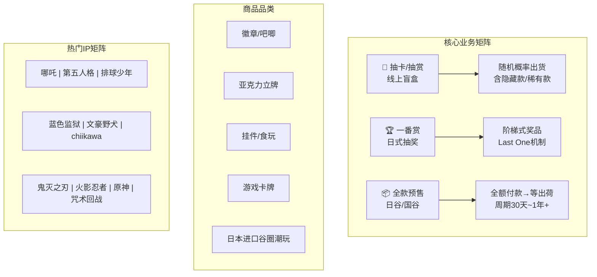

**商业模式关键特征**：

1. **高预售占比**：大量商品采用"全款预售"模式，用户付全款后等待数月至一年以上方可发货，资金由平台持有
2. **盲盒/概率消费**：抽卡和一番赏涉及随机概率，用户为获取心仪款式/隐藏款可能反复消费
3. **海外供应链依赖**：部分商品源自日本厂商，涉及海外制造→海关清关→国内仓库→发货的复杂链路
4. **情绪驱动消费**：用户因IP情感投入产生的消费，对商品品质、发货速度和客服态度极为敏感

### 1.3 用户画像与行为特征

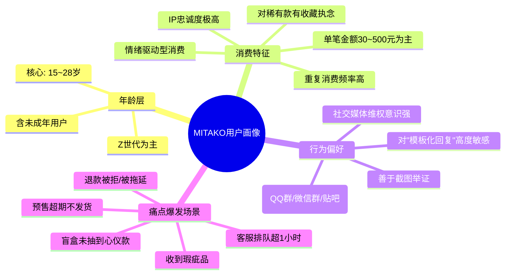

**关键用户行为数据**：

| 行为维度 | 估算数据 | 数据来源 |
|---------|---------|---------|
| 日均客服触达用户 | ≈ 2,000人 | 甲方内部数据 |
| 日均生成工单 | ≈ 200~300条 | 甲方内部数据 |
| 日均发货订单 | ≈ 10,000单 | 甲方春节后运营数据 |
| 人工客服平均排队时长 | > 60分钟 | 南方都市报用户调查 |
| 黑猫投诉累计量 | ≈ 2,000条 | 黑猫投诉平台 |
| 消费保投诉量 | 数百条 | 消费保平台 |
| 微信小程序风险标记 | "评价不佳，注意甄别" | 南方都市报报道 |

### 1.4 现有客服体系现状

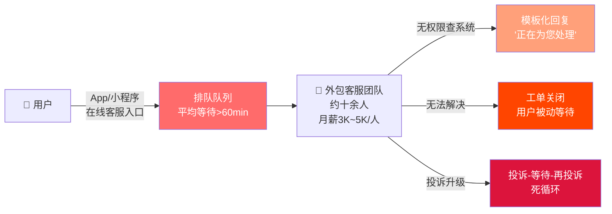

**现有客服体系的致命缺陷清单**：

| 问题维度 | 具体表现 | 影响评估 |
|---------|---------|---------|
| **人员素质** | 外包人员不了解二次元文化，无法与用户共情 | 用户满意度极低 |
| **系统权限** | 客服无法直接查询订单系统、物流系统 | 无法提供有效信息 |
| **处理能力** | 只能使用预设模板回复，无法处理复杂场景 | 问题堆积恶化 |
| **响应速度** | 人工排队超1小时，客服高峰期更久 | 用户流失/投诉升级 |
| **闭环能力** | 工单被无故关闭，缺乏状态跟踪 | 信任崩塌 |
| **成本效率** | 年消费近100万，但问题解决率极低 | ROI趋近于零 |
| **风控能力** | 无法识别高风险投诉，无法分级处理 | 舆情失控 |

---

## 2. 核心痛点深度诊断

### 2.1 发货延迟危机 — 供应链信任崩塌

#### 典型案例

> **案例来源**：南方都市报 2025-03-20《上虾淘购"谷子"苦等200多天不发货》
>
> 多名消费者反映在MITAKO虾淘平台购买动漫周边商品后，等待发货时间长达200余天，甚至有用户表示"下单一年仍未收到货"。部分用户在超过平台标注的"出荷"日期后继续等待，却发现平台在用户不知情的情况下擅自修改出荷日期。

> **案例来源**：人民网上海频道 2025-03-19 谷子经济乱象调查
>
> 消费者投诉虾淘存在严重的全款预售模式异化问题。用户全额付款后，平台以"海外厂商产能不足""海关清关延误"为由，反复推迟发货，但部分涉及国内IP的商品同样出现长期拖延，用户质疑平台说辞的真实性。

#### 数据量化

| 指标 | 数据 | 说明 |
|------|------|------|
| 最长等待时间 | > 365天 | 极端案例：下单一整年未收货 |
| 典型延迟时间 | 200+ 天 | 南方都市报报道的中位数案例 |
| 日均发货量 | ≈ 10,000单 | 相对于积压订单量，发货能力存在缺口 |
| 延迟借口占比 | 约90%归因于"海外厂商/海关" | 但国内IP同样延迟，说辞缺乏可信度 |
| 出荷日期修改 | 频繁且无有效通知 | 用户发现日期被篡改后情绪爆发 |

#### 根因分析

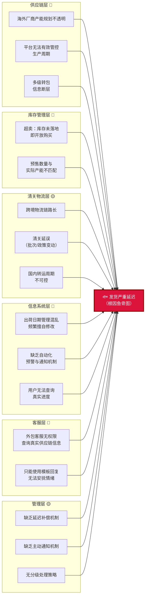

**根因汇总表**：

| 根因层级 | 具体原因 | 严重程度 |
|----------|---------|---------|
| **供应链层** | 海外厂商产能规划不透明，平台无法有效管控生产周期 | 🔴 高 |
| **库存管理层** | 超卖现象：在库存未落地前即开放购买 | 🔴 高 |
| **清关物流层** | 跨境物流链路长，存在清关延误风险 | 🟡 中 |
| **信息系统层** | 出荷日期管理混乱，缺乏自动化预警与通知 | 🔴 高 |
| **客服层** | 外包客服无法获取真实供应链信息，只能复读模板 | 🔴 高 |
| **管理层** | 缺乏"延迟补偿"和"主动通知"机制设计 | 🟡 中 |

#### 发货状态流转问题图

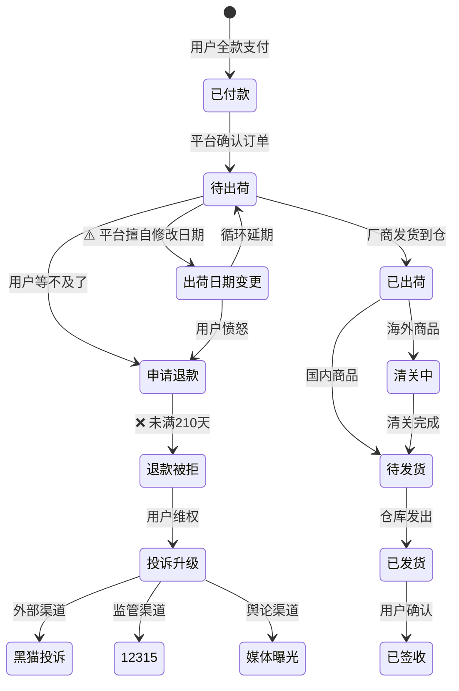

### 2.2 退款困境 — 霸王条款与资金风控

#### 协议条款深度分析

| 场景 | 平台退款条件 | 行业通行标准 | 法律风险评估 |
|------|------------|------------|------------|
| **盲盒/抽赏** | 出荷延迟≥210天方可退款 | 通常7~30天可退 | 🔴 涉嫌格式条款无效 |
| **非抽赏商品** | 付款后30分钟内可退 | 7天无理由退货 | 🔴 严重违反消法 |
| **退款形式** | 部分退"水晶"（平台代币）而非现金 | 应原路退回支付渠道 | 🔴 律师认定可能构成欺诈 |
| **未成年人退款** | 索要过度个人隐私资料，恶意拖延 | 法定监护人申请应优先处理 | 🔴 违反未成年人保护法 |

#### 法律风险清单

> **来源**：南方都市报引述律师观点

1. **格式条款效力争议**：根据《民法典》第497条，提供格式条款一方不合理地免除或者减轻其责任、加重对方责任、限制对方主要权利的，该格式条款无效。虾淘"210天才可退款"和"30分钟内退款窗口"的条款极可能被法院认定无效
2. **平台代币退款问题**：以不可兑现现金的"水晶"代替现金退款，律师明确指出可能构成消费欺诈
3. **未成年人保护合规风险**：2025年3月上海市黄浦区市场监管局发布《黄浦区二次元衍生商品和服务经营合规指引》，明确不得向8周岁以下未成年人销售二次元衍生商品和服务

#### 退款流程问题图

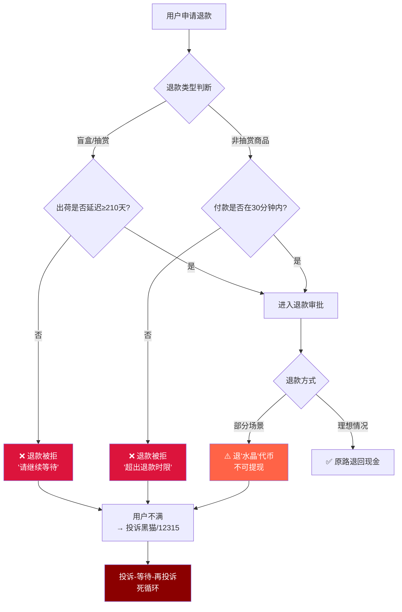

### 2.3 客服系统失灵 — 外包模式的致命缺陷

#### 现有客服流程分析

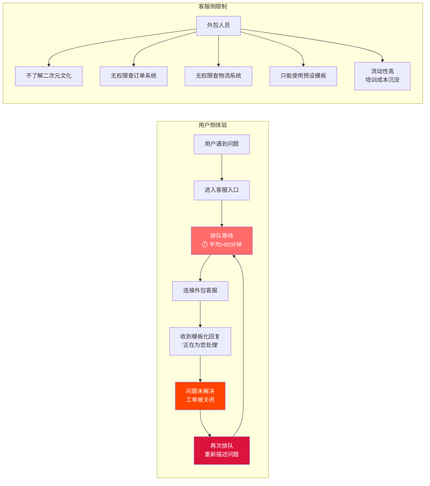

#### 用户投诉路径图

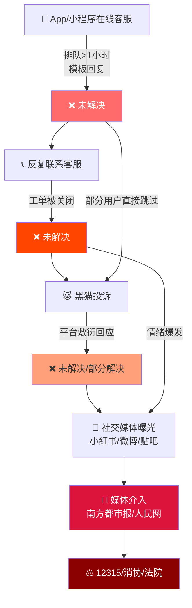

#### 痛点量化

| 痛点维度 | 量化指标 | 说明 |
|---------|---------|------|
| 首次响应时间 | > 60分钟 | 行业优秀水平 < 30秒 |
| 问题一次性解决率 | 极低（估 < 20%） | 外包客服无系统权限，只能转述 |
| 工单闭环率 | 低（大量工单被无故关闭） | 用户需反复提交同一问题 |
| 客服满意度 | 极差 | 微信小程序被标记"评价不佳" |
| 客服人均成本 | 3,000~5,000元/月 | 低薪导致高流动性和低专业度 |
| 年度客服总成本 | ≈ 100万元 | 高投入低产出 |
| 重复咨询率 | 高（估 > 40%） | 同一问题被反复提出 |

### 2.4 盲盒争议 — 信任危机与合规风险

#### 争议焦点

| 争议类型 | 用户质疑 | 平台回应 | 风险评估 |
|---------|---------|---------|---------|
| **概率不透明** | 多次抽奖未获心仪款，怀疑暗调概率 | 未公示具体概率数据 | 🔴 违反《盲盒经营行为规范指引》 |
| **"吞烫"质疑** | 先发普通款，扣留热门/隐藏款 | 未做公开回应 | 🔴 涉嫌欺诈 |
| **限量数量不公示** | 隐藏款/稀有款投放数量不透明 | 未公示 | 🟡 合规风险 |
| **诱导超额消费** | "超高概率""必中"等营销话术 | 营销表述模糊 | 🔴 涉嫌虚假宣传 |

#### 合规要求对比

| 监管要求 | 来源 | 虾淘现状 | 差距 |
|---------|------|---------|------|
| 公示抽取概率 | 《盲盒经营行为规范指引》 | ❌ 未公示 | 不合规 |
| 公示限量数量 | 《盲盒经营行为规范指引》 | ❌ 未公示 | 不合规 |
| 不向8岁以下儿童销售 | 上海黄浦区合规指引（2025-03） | ❓ 无年龄核验机制 | 待确认 |
| 退款渠道透明 | 《消费者权益保护法》 | ❌ 以代币替代现金 | 严重不合规 |

### 2.5 品控与售后 — 最后一公里的崩坏

#### 典型问题

| 问题类型 | 表现 | 用户反馈 | 平台处理 |
|---------|------|---------|---------|
| 做工粗糙 | 接缝不平、印刷偏色、部件松动 | "和宣传图差距极大" | 推诿/要求用户举证 |
| 污渍/磨损 | 商品有明显使用痕迹或污渍 | "怀疑是退货二次发出" | 以"运输导致"推责 |
| 错发漏发 | 收到非本人购买的商品或少件 | "根本没有品控流程" | 要求拍照→长时间等待 |
| 售后拒绝 | "无开箱视频不予处理""售出不退不换" | "这就是霸王条款" | 格式条款保护自身 |

#### 品控与售后闭环缺失

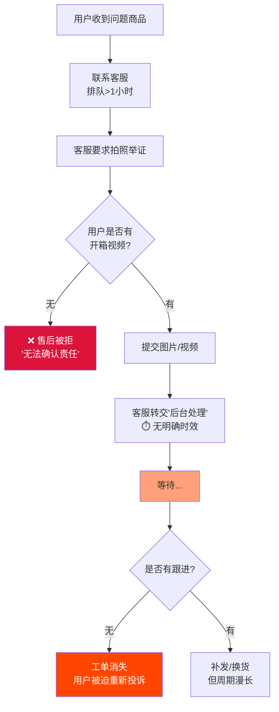

---

## 3. 舆情态势分析

### 3.1 主要投诉平台数据汇总

| 平台 | 投诉量（截至2025年Q1） | 主要投诉类型 | 平台处理情况 |
|------|-------|------------|------------|
| **黑猫投诉** | ≈ 2,000条 | 发货延迟、退款难、客服不作为 | 部分回复但解决率低 |
| **消费保** | 数百条 | 退款争议、霸王条款 | 部分介入调解 |
| **12315** | 多起投诉 | 消费者权益保护 | 属地市场监管介入 |
| **微信小程序** | 触发风险提示 | 综合差评 | 被标记"评价不佳，注意甄别" |
| **App Store** | 评分4.0/5 | 夹杂大量差评 | 评分呈下降趋势 |

### 3.2 社交媒体传播路径

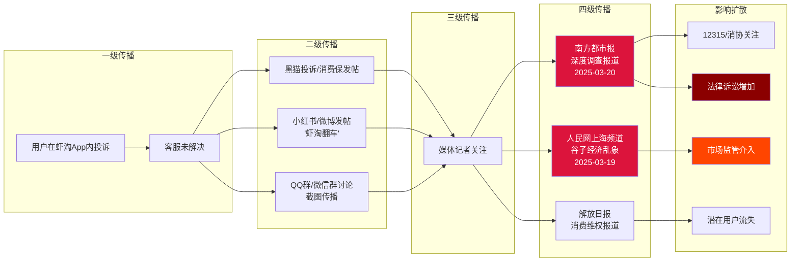

**关键媒体报道时间线**：

| 时间 | 媒体 | 标题/主题 | 影响 |
|------|------|----------|------|
| 2025-03-15前夕 | 中国消费者协会 | 年度十大消费维权舆情热点："吃谷人消费陷阱难维权" | 全国性关注 |
| 2025-03-19 | 人民网上海频道 | 谷子经济乱象调查，虾淘被点名 | 监管层面关注 |
| 2025-03-20 | 南方都市报 | 《上虾淘购"谷子"苦等200多天不发货》 | 深度调查引发二次传播 |
| 2025-03 | 上海黄浦区市场监管局 | 《二次元衍生商品和服务经营合规指引》 | 行业首个合规指引 |

### 3.3 法律诉讼风险评估

| 风险类型 | 当前状态 | 风险等级 | 潜在后果 |
|---------|---------|---------|---------|
| **网络买卖合同纠纷** | 已有多起诉讼（天眼查/裁判文书网可查） | 🔴 高 | 批量诉讼可能性大 |
| **消费欺诈认定** | 律师公开认定"水晶退款"可能构成欺诈 | 🔴 高 | 三倍赔偿风险 |
| **格式条款无效** | 210天退款/30分钟退款窗口极可能被判无效 | 🔴 高 | 条款体系需全面修订 |
| **未成年人保护** | 索要过度隐私资料、拖延退款 | 🟡 中 | 行政处罚风险 |
| **虚假宣传** | 盲盒概率不公示、营销话术模糊 | 🟡 中 | 市场监管处罚 |
| **资金安全** | 独立App/小程序缺乏第三方资金监管 | 🔴 高 | 可能被定性为违规预付卡 |

### 3.4 品牌声誉修复窗口期判断

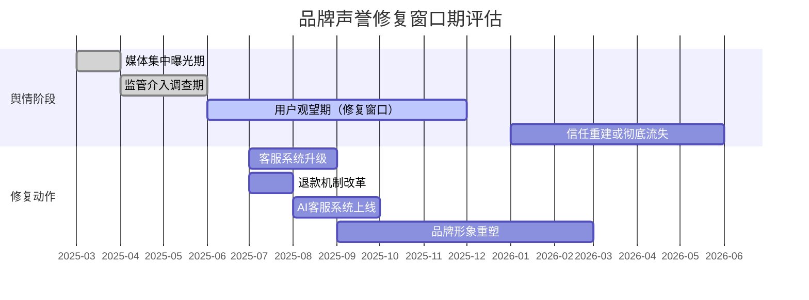

**窗口期判断**：

- **当前处于**：用户观望期 — 媒体热度下降后，用户在等待平台改进信号
- **最佳修复窗口**：6~12个月内完成客服系统升级和退款机制改革
- **如果错过**：用户信任将不可逆转地流向竞品平台，品牌声誉将从"有争议"变为"已弃用"
- **AI客服系统的意义**：不仅是降本增效，更是向用户和监管展示"平台在改进"的关键信号

---

## 4. AI客服系统需求推导

### 4.1 按场景优先级分类的需求矩阵

| 优先级 | 场景 | 对应痛点 | AI解决方案 | 预期效果 |
|:------:|------|---------|-----------|---------|
| **P0** | 订单/物流状态查询 | 排队>1小时只为查一个物流 | AI实时查询订单系统+物流API，秒级响应 | 首响 <3秒，释放30%客服压力 |
| **P0** | 发货延迟主动通知 | 用户等200天无任何通知 | AI监控出荷日期变更，自动推送通知+安抚 | 将被动投诉转为主动服务 |
| **P0** | 退款流程透明化 | 退款规则不透明，用户被拒后情绪失控 | AI清晰解释退款规则、当前进度、预计时间 | 降低因信息不对称导致的投诉 |
| **P1** | 预售延期情绪安抚 | "是不是骗人？"等高情绪场景 | AI识别情绪等级，先共情再给事实和时间线 | 降低投诉升级率 |
| **P1** | 退换货流程自动推进 | 工单被关闭，用户反复描述问题 | AI自动收集举证材料、生成仓库协同单、跟进状态 | 工单闭环率显著提升 |
| **P1** | 盲盒争议安抚 | "10个没抽到推，退钱" | AI承接失落感，解释规则，提供替代方案 | 减少冲动退款/差评 |
| **P2** | 商品品质投诉 | 做工粗糙/污渍/错发 | AI引导拍照举证，自动生成售后工单 | 售后处理效率提升 |
| **P2** | 高风险投诉识别 | "要投诉/曝光/起诉" | AI识别风险关键词，自动升级至主管/法务 | 降低舆情失控风险 |
| **P2** | 未成年人退款 | 索要过度资料、恶意拖延 | AI按合规指引优先处理，简化流程 | 规避监管处罚风险 |
| **P3** | 商品咨询/推荐 | 库存、规格、IP相关 | AI基于商品知识库回答，推荐相似商品 | 提升转化率 |
| **P3** | 私域社群客服 | 10,000+群中重复问题 | AI在企微群内自动回答高频问题 | 降低社群运营人力成本 |

### 4.2 AI可解决的问题 vs 需要业务变革的问题

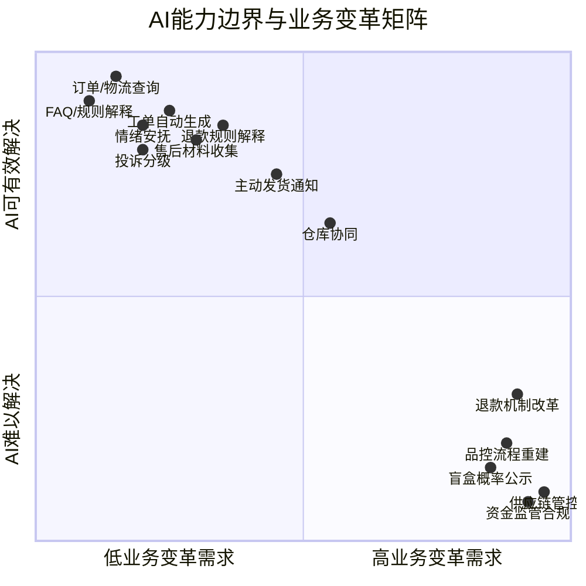

**结论分类**：

| 分类 | 具体问题 | 解决路径 |
|------|---------|---------|
| ✅ **AI直接解决** | 订单/物流查询、FAQ回答、情绪安抚、工单自动生成、投诉分级路由、售后材料收集引导 | AI客服系统核心能力 |
| 🔄 **AI辅助+业务配合** | 退款流程透明化、主动发货通知、仓库协同、售后闭环追踪 | AI提供能力，但需甲方开放系统接口 |
| ⚠️ **必须业务变革** | 退款机制改革（取消210天条款）、供应链管控、盲盒概率公示、资金监管合规、品控流程重建 | AI无法替代，甲方必须自行推进 |

### 4.3 甲方必须配合的前置条件

> [!IMPORTANT]
> 以下条件缺失任何一项，都将显著限制AI客服系统的实际效果。这不是"技术限制"，而是"业务限制"。

| 前置条件 | 必要性 | 当前状态评估 | 需甲方提供 |
|---------|:------:|------------|-----------|
| **订单系统API** | 🔴 必须 | 存在但可能未标准化 | 查询接口文档、测试环境、授权凭证 |
| **物流系统API** | 🔴 必须 | 部分可通过第三方查询 | 快递接口或物流聚合服务 |
| **出荷日期数据** | 🔴 必须 | 当前管理混乱 | 结构化出荷日期字段、变更日志 |
| **售后/退款系统接口** | 🔴 必须 | 存在内部系统 | 退款状态查询、规则配置接口 |
| **客服后台API** | 🔴 必须 | 自建后台可查工单 | 工单读取、消息回写、状态更新接口 |
| **SOP/FAQ文档** | 🔴 必须 | 可能存在但不完整 | 完整售后规则、预售说明、盲盒规则 |
| **历史工单数据** | 🟡 强烈建议 | 应有积累 | 脱敏后1,000+条典型工单 |
| **仓库系统对接** | 🟡 强烈建议 | 未与客服打通 | API或飞书/企微/webhook桥接 |
| **退款政策修订** | 🟡 强烈建议 | 当前条款有法律风险 | 法务团队修订后的新版退款政策 |
| **品牌人格定义** | 🟢 建议 | 暂无统一客服形象 | 品牌调性、禁用词列表、语气偏好 |

### 4.4 分阶段目标设定

```mermaid
timeline
    title AI客服系统分阶段目标
    section 第一阶段: 7天MVP
        Day 1-3 : 需求收敛 + 数据准备
              : SOP清洗 + 知识库构建
              : 模拟数据 + 工单Demo
        Day 4-5 : Agent工作流搭建
              : 历史工单回放测试
        Day 6-7 : 联调 + 客户演示
              : 验收 + 锁定正式版范围
    section 第二阶段: 30天正式开发
        Week 1 : 生产接入 + 安全边界
              : 订单/物流/售后API对接
        Week 2 : 售后流程 + 仓库协同
              : 状态机 + 协同单
        Week 3 : 人格 + 情绪 + 质检
              : 二次元风格 + 投诉处理
        Week 4 : 灰度上线 + 运营闭环
              : 10%→30%→60%→80%
    section 第三阶段: 持续运营
        Month 2-3 : 数据飞轮 + 知识库迭代
              : CSAT追踪 + 人力优化
        Month 4-6 : 私域Agent扩展
              : 企微群智能客服
```

**各阶段核心KPI**：

| 阶段 | 核心指标 | 目标值 |
|------|---------|-------|
| **MVP** | 演示链路完整度 | 覆盖6大核心场景 |
| **MVP** | 意图识别准确率 | > 85% |
| **正式V1** | 平均首响时间 | < 3秒 |
| **正式V1** | 高频低风险自动化率 | 70%~90% |
| **正式V1** | 一线人工工作量下降 | 70%~85% |
| **正式V1** | 高风险识别召回率 | > 98% |
| **正式V1** | 越权承诺拦截率 | > 99% |
| **持续运营** | 用户满意度 | 高于人工客服基线 |
| **持续运营** | 年度客服成本节约 | > 50万元 |

---

## 5. 竞品参考与行业标杆

### 5.1 同行业（谷子电商）客服模式对比

| 维度 | MITAKO虾淘 | 头部潮玩平台（泡泡玛特） | 主流电商平台（淘宝/京东） |
|------|-----------|-------------------|---------------------|
| **客服模式** | 纯外包人工 | 自建+AI辅助 | AI为主+人工兜底 |
| **首次响应** | > 60分钟 | < 30秒 | < 5秒 |
| **系统对接** | 客服无权限查系统 | 客服系统全链路打通 | 全链路自动化 |
| **退款机制** | 210天/30分钟 | 符合消法7天无理由 | 7天无理由+运费险 |
| **情绪处理** | 模板化回复 | 有分级处理 | AI情绪识别+自动升级 |
| **成本效率** | ≈100万/年，效果差 | 高投入高效率 | AI替代80%+人工量 |
| **用户满意度** | 极差（被标记风险） | 中等偏上 | 行业领先 |

### 5.2 AI客服落地案例参考

| 案例 | 行业 | 方案 | 关键成果 | 对虾淘的启示 |
|------|------|------|---------|-------------|
| **泡泡玛特智能客服** | 潮玩/盲盒 | AI+人工分层，AI承接80%标准问答 | 首响<30秒，人力成本降40% | 同品类验证AI可行性 |
| **得物(POIZON)** | 潮流电商 | AI鉴别辅助+客服自动化 | 售后效率提升60% | 举证引导+自动化流程 |
| **京东JIMI** | 综合电商 | 全链路AI客服 | 日处理百万级咨询，替代率>85% | 技术路线参考 |
| **网易七鱼** | SaaS客服 | AI Bot+工单+质检 | 客户首响降至5秒内 | 产品形态参考 |

#### AI客服行业最佳实践总结

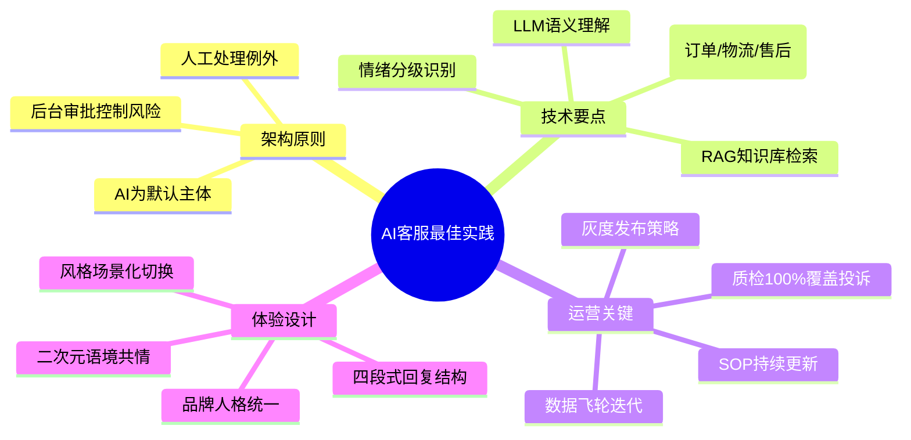

---

## 附录A：信息来源索引

| 编号 | 来源 | 标题/主题 | 日期 | 用途 |
|:----:|------|---------|------|------|
| S1 | 南方都市报 (oeeee.com) | 《上虾淘购"谷子"苦等200多天不发货》 | 2025-03-20 | 核心案例来源 |
| S2 | 人民网上海频道 (people.com.cn) | 谷子经济消费陷阱/乱象调查 | 2025-03-19 | 行业问题背景 |
| S3 | 中国消费者协会 | 2024年度十大消费维权舆情热点 | 2025-03 | "吃谷人"消费陷阱上榜 |
| S4 | 上海黄浦区市场监管局 | 《二次元衍生商品和服务经营合规指引》 | 2025-03 | 合规要求参考 |
| S5 | 黑猫投诉平台 | 虾淘/MITAKO相关投诉 | 持续更新 | 投诉量及类型统计 |
| S6 | 消费保平台 | 虾淘相关投诉 | 持续更新 | 投诉量补充 |
| S7 | Apple App Store | MITAKO虾淘应用页面 | 持续更新 | 评分及评价数据 |
| S8 | 天眼查/企查查 | 上海弹好团科技有限公司企业信息 | 持续更新 | 诉讼记录 |
| S9 | 中国裁判文书网 | 相关网络买卖合同纠纷 | 持续更新 | 法律诉讼案例 |
| S10 | 甲方内部数据 | 客服工单、运营数据 | — | 业务数据参考 |

## 附录B：术语对照表

| 术语 | 解释 |
|------|------|
| **谷子** | 二次元动漫周边商品的统称，源自日语"goods"的音译 |
| **吃谷** | 购买二次元周边商品的行为 |
| **出荷** | 日语"出荷（しゅっか）"，指商品制造完成并出库，类似"出货" |
| **一番赏** | 日式抽奖形式，每个奖品对应不同等级（A赏、B赏等），Last One为最后一抽奖品 |
| **吧唧** | 徽章/胸针类周边的俗称，源自日语"バッジ(badge)" |
| **推** | 最喜欢的角色，源自日语"推し（おし）" |
| **吞烫** | 玩家用语，指平台在盲盒抽取中涉嫌扣留热门款/稀有款的行为 |
| **端盒** | 购买盲盒系列全套产品 |
| **隐藏款** | 盲盒中概率极低的稀有款式 |
| **水晶** | 虾淘平台内部代币，部分场景用于替代现金退款 |

---

> **文档状态**：初版完成  
> **下一步动作**：基于本诊断报告，推进 [02-系统架构设计文档] 的编制  
> **关联文档**：[二次元电商客服Agent最终规划方案.md](./二次元电商客服Agent最终规划方案.md)
