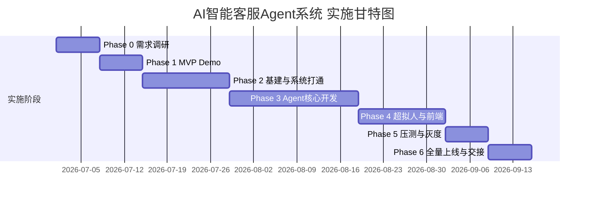
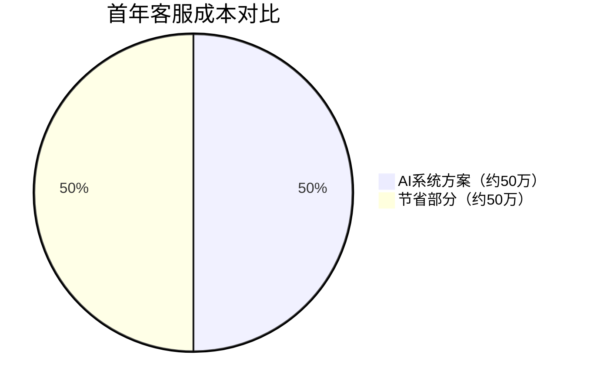
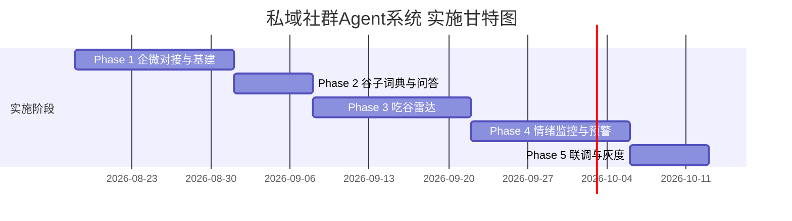
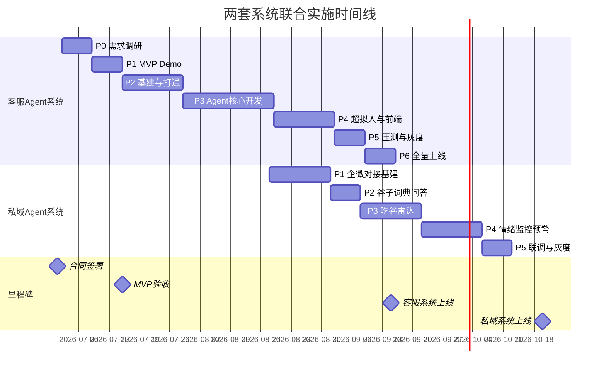

# MITAKO虾淘 AI Agent系统 商业报价方案 v1.0

> **提案方**：XX科技（AI Agent解决方案服务商）
> **甲方**：上海弹好团科技有限公司（MITAKO虾淘）
> **报价日期**：2026年6月
> **有效期**：本报价自发出之日起30个自然日内有效
> **文档密级**：商业机密 — 仅限甲乙双方核心决策层阅读

---

## 1. 执行摘要

### 痛点

MITAKO虾淘作为国内头部二次元周边电商平台，当前面临两大核心运营瓶颈：

1. **客服成本居高不下**：十余名外包客服年消费约 **100万元**，但受限于外包人员流动性高、二次元文化理解薄弱、情绪安抚能力参差不齐，导致客诉升级率偏高、用户满意度难以保障，且无法形成数据沉淀与服务优化闭环。
2. **百万私域资产沉睡**：10,000+ 个企业微信社群覆盖约 **100万用户**，目前仅用于单向推送活动信息，缺乏互动运营、精准触达与舆情监控能力，私域流量的复购转化和品牌粘性价值几乎为零。

### 方案

XX科技为MITAKO虾淘量身定制 **两套AI Agent系统**，整体替代传统外包客服与人力社群运营：

| 系统 | 核心能力 | 替代目标 |
| --- | --- | --- |
| **AI智能客服Agent系统** | 意图识别、情绪安抚、工单自动处理、仓库协同、后台审批 | 替代80%一线外包客服工作量 |
| **私域社群AI运营Agent系统** | 谷子词典问答、吃谷雷达推送、群内舆情监控与危机阻断 | 激活百万私域用户，防范群内舆情扩散 |

### 价值

| 维度 | 当前状态 | 上线后预期 |
| --- | --- | --- |
| 客服年支出 | 100万元/年（外包） | **50万元/年**（AI系统服务费），**节省50%** |
| 平均首响时间 | 30-120秒（人工排队） | **<3秒**（AI即时响应） |
| 服务时间 | 工作日 9:00-21:00 | **7×24小时** 全天候 |
| 私域运营产出 | ≈0（纯推送，无互动） | 预估带动 **15-25万元/年** 增量GMV |
| 舆情响应 | 人工发现（滞后数小时） | **秒级监控**，自动阻断+安抚 |
| 数据沉淀 | 无结构化积累 | 全链路可追溯，驱动业务优化飞轮 |

### 价格

| 项目 | 首年总费用 |
| --- | ---: |
| AI智能客服Agent系统 | 498,500元 |
| 私域社群AI运营Agent系统 | 371,500元 |
| **打包优惠价（推荐）** | **870,000元** ≈ **87万元** |

> **一句话总结**：以不到原外包费用的总投入，同时获得7×24小时智能客服 + 百万私域激活两大系统，首年即可实现正向ROI。

---

## 2. 方案一：AI智能客服Agent系统

### 2.1 项目范围

本系统覆盖MITAKO虾淘全渠道客服场景，构建"AI默认承接、人工例外审批"的新型客服运营模式：

**功能范围**：
- 全场景意图识别与智能路由（订单查询、物流追踪、退换货、预售问题、盲盒争议、商品咨询、投诉处理）
- 六级情绪识别与超拟真安抚引擎（含二次元人格、GIF表情包系统）
- RAG知识库（SOP、FAQ、售后规则、预售规则、盲盒规则）
- 业务系统API对接（订单、物流、售后、仓库协同）
- 自动工单处理（摘要、标签、状态流转、下一步动作）
- 后台审批与风控机制（大额退款、法务/监管、企业灵活政策）
- 质检系统（越权承诺拦截、政策一致性校验、情绪刺激检测）
- 用户记忆系统（IP偏好、历史情绪、个性化安抚策略）
- 运维监控大屏与数据报表

**渠道范围**：
- 甲方现有客服后台（首要对接）
- App内嵌客服窗口
- 微信小程序客服
- 企业微信客服通道

**不含范围**：
- 甲方内部ERP/财务系统改造
- 甲方App/小程序本体开发
- 仓库WMS系统开发（仅对接API或中间层桥接）

### 2.2 核心交付物

| 序号 | 交付物 | 说明 |
| ---: | --- | --- |
| 1 | AI客服Agent引擎 | 基于LangGraph的多Agent状态机工作流，支持意图路由、情绪识别、工具调用、回复生成、质检审查全链路 |
| 2 | Chatwoot客服工作台（二开） | 人工坐席台、AI处理看板、工单管理、审批队列、质检后台 |
| 3 | RAG知识库系统 | 基于Qdrant向量库，支持SOP/FAQ/规则的版本化管理与实时检索 |
| 4 | 用户记忆库 | 基于Mem0的长短期记忆系统，实现千人千面的安抚策略 |
| 5 | LLM网关与模型管理 | 基于LiteLLM的多模型路由、成本控制、限流、负载均衡 |
| 6 | 超拟真表情包系统 | Meme向量库 + 后处理引擎，AI自动调用二次元GIF/表情 |
| 7 | 动态卡片协议 | 订单进度卡片、补偿券卡片、售后流程卡片等富交互组件 |
| 8 | 仓库协同中间层 | 结构化协同单生成、状态跟踪，支持Webhook/企微/飞书桥接 |
| 9 | 观测与评测系统 | 基于Langfuse的全链路Tracing、Prompt管理、回归测试 |
| 10 | 运维文档与培训 | 系统架构文档、运维手册、SOP管理指南、培训视频 |

### 2.3 分阶段实施计划

| 阶段 | 周期 | 核心交付物 | 人天 | 费用 |
| --- | --- | --- | ---: | ---: |
| Phase 0: 需求调研 | 1周 | 需求文档、30+场景清单、API接口清单、数据样本收集 | 5 | 12,500元 |
| Phase 1: MVP Demo | 1周 | 可体验的客服Agent Demo（6大核心场景跑通，含模拟数据） | 10 | 27,500元 |
| Phase 2: 基建与系统打通 | 2周 | Chatwoot底座部署、甲方订单/物流/售后API联调、Mem0记忆库、Qdrant知识库 | 15 | 42,500元 |
| Phase 3: Agent核心开发 | 3周 | LangGraph多Agent工作流、意图路由引擎、情绪识别引擎、规则引擎、质检Agent | 25 | 72,500元 |
| Phase 4: 超拟人与前端 | 2周 | 动态卡片协议、Meme表情库、App/小程序/企微端联调、人格微调 | 15 | 40,000元 |
| Phase 5: 压测与灰度 | 1周 | 1000条历史工单回放、压力测试、高危拦截测试、10%流量灰度 | 10 | 25,000元 |
| Phase 6: 全量上线与交接 | 1周 | 全量上线、运维文档交付、甲方团队培训（3天）、交接验收 | 5 | 12,500元 |
| **合计** | **11周** | | **85** | **232,500元** |

### 2.4 团队配置

| 角色 | 人数 | 职责 | 参与阶段 |
| --- | ---: | --- | --- |
| 架构师/后端负责人 | 1 | 系统架构设计、LangGraph工作流开发、API联调、数据库设计 | Phase 0-6 |
| AI工程师 | 1 | Prompt工程、Agent调优、RAG知识库构建、模型评测与选型 | Phase 0-6 |
| 前端工程师 | 1 | Chatwoot二开、动态卡片开发、多端联调 | Phase 2-5 |
| 测试/质检工程师 | 1 | 场景测试、历史工单回放、压力测试、质检规则验证 | Phase 4-6 |
| 产品/实施经理 | 1 | 需求对接、SOP清洗、话术设计、甲方沟通、验收管理 | Phase 0-6 |
| 项目经理 | 0.5 | 项目进度管控、风险管理、里程碑汇报 | Phase 0-6 |

### 2.5 费用明细

#### 2.5.1 实施费（一次性）

| 费用项 | 单价 | 数量 | 小计 |
| --- | ---: | ---: | ---: |
| 架构师/后端 | 3,500元/人天 | 45天 | 157,500元 |
| AI工程师 | 3,000元/人天 | 50天 | 150,000元 |
| 前端工程师 | 2,500元/人天 | 25天 | 62,500元 |
| 测试/质检 | 2,000元/人天 | 15天 | 30,000元 |
| 产品/实施 | 2,500元/人天 | 15天 | 37,500元 |
| 项目管理 | 2,000元/人天 | 10天 | 20,000元 |
| **实施费小计** | | **160天** | **457,500元** |

> 打折后实施费优惠价见 [4.1 打包方案](#41-两套系统联合实施优惠)

#### 2.5.2 年度SaaS服务费（按年收取，首年含于总价）

| 费用项 | 费用说明 | 费用/年 |
| --- | --- | ---: |
| 系统运维与迭代 | 系统监控、Bug修复、季度功能迭代（含2次/季Prompt优化） | 120,000元 |
| LLM API Token费用 | 主模型Qwen3.5-Flash + 多模态Gemini-3.1-Flash-Lite，日均2000会话，按月实报实销上限封顶 | 96,000元 |
| 向量数据库与存储 | Qdrant向量库 + 对话日志 + 工单数据存储，含备份 | 24,000元 |
| 客户成功支持 | 专属客户成功经理、月度运营报告、SOP更新支持 | 48,000元 |
| **年度服务费小计** | | **288,000元** |

> **LLM Token费用估算依据**：
> - 日均2,000会话 × 平均3轮对话 × 平均1,500 Token/轮 = 日均 900万 Token
> - Qwen3.5-Flash 约 0.3元/万Token（输入+输出混合均价），月均约 8,000元
> - 含多模态图片理解（瑕疵图片、物流截图）月均约 1,500元
> - 月均合计约 8,000元，年度 96,000元，实际按量结算，设年度封顶上限

#### 2.5.3 总费用（方案一单独报价）

| 项目 | 金额 |
| --- | ---: |
| 一次性实施费（打折前） | 457,500元 |
| 首年实施费优惠（9折） | **411,750元** → 取整 **410,000元** |
| 首年年度SaaS服务费 | 88,500元 |
| **方案一首年总价** | **498,500元** ≈ **50万元** |
| 次年起年度服务费 | 288,000元/年 |

> **说明**：首年总价包含全部实施交付 + 首年剩余月份的按比例SaaS服务费（按上线后约3.5个月计算，88,500元）。次年起按完整年度收取288,000元SaaS服务费。

### 2.6 ROI分析

#### 成本对比（首年）

| 对比维度 | 当前外包模式 | AI Agent系统 | 差异 |
| --- | ---: | ---: | ---: |
| 年度总成本 | 1,000,000元 | 498,500元 | **-501,500元（节省50%）** |
| 客服人数 | 12-15人 | 保留2-3人（质检+审批+异常） | 减少10-12人 |
| 服务时间 | 9:00-21:00 | 7×24小时 | 服务时长提升 **100%** |
| 平均首响 | 30-120秒 | <3秒 | 提速 **10-40倍** |
| 服务一致性 | 因人而异 | 统一品牌人格 | 质的提升 |
| 数据沉淀 | 几乎为零 | 全链路可追溯 | 从0到1 |

#### 三年TCO对比

| 年度 | 外包模式累计 | AI系统累计 | 累计节省 |
| --- | ---: | ---: | ---: |
| 第1年 | 1,000,000元 | 498,500元 | 501,500元 |
| 第2年 | 2,000,000元 | 786,500元 | 1,213,500元 |
| 第3年 | 3,000,000元 | 1,074,500元 | **1,925,500元** |

> **三年累计节省近200万元**，同时获得7×24小时服务、品牌人格统一、数据资产沉淀等外包模式永远无法提供的增量价值。

### 2.7 验收标准

#### 阶段验收

| 阶段 | 验收条件 |
| --- | --- |
| Phase 1 MVP | 6大核心场景Demo可体验，甲方决策层确认满意 |
| Phase 2 基建 | 甲方3个以上核心API联调通过，数据读写正确 |
| Phase 5 灰度 | 10%真实流量灰度运行2周，无重大事故 |
| Phase 6 全量 | 全量上线运行1个月，各项指标达标 |

#### 全量上线验收指标

| 指标 | 目标值 | 计算方式 |
| --- | ---: | --- |
| 意图识别准确率 | ≥95% | 随机抽样200条会话人工复核 |
| 平均首响时间 | <3秒 | 系统日志统计P95 |
| 一线人工接待下降 | ≥70% | 对比上线前后人工接待工单数 |
| 高频低风险自动化率 | ≥80% | 物流/订单/FAQ等场景AI自动闭环比例 |
| 越权承诺 | 0次 | 全量质检，灰度+全量期间零容忍 |
| 用户满意度 | ≥人工基线 | 会话结束后评分，对比上线前人工平均分 |
| 高风险识别召回率 | ≥98% | 涉及法务/大额/舆情的会话识别覆盖率 |
| 系统可用性 | ≥99.5% | 月度统计，不含计划维护窗口 |

---

## 3. 方案二：私域社群AI运营Agent系统

### 3.1 项目范围

本系统面向MITAKO虾淘 10,000+ 个企业微信私域社群，构建"智能群管 + 精准触达 + 舆情阻断"三位一体的AI社群运营体系：

**功能范围**：
- 企业微信群消息通道对接（合规API或稳定Hook方案）
- 谷子词典 & 日常问答系统（RAG知识库驱动）
- 吃谷雷达智能推送系统（商品事件监听 + 群标签精准分发）
- 群内情绪监控与舆情预警引擎（滑动窗口情感分析）
- 危机自动阻断与安抚机制（群内安抚 + 私聊引导至AI客服）
- 社群活跃度分析与运营报表

**不含范围**：
- 企业微信账号申请与认证
- 甲方商品后端/供应链系统改造
- 社群拉新/裂变工具开发

### 3.2 核心交付物

| 序号 | 交付物 | 说明 |
| ---: | --- | --- |
| 1 | 企微群消息网关 | 万群并发消息收发、事件驱动架构（Kafka/RabbitMQ） |
| 2 | 社群AI Agent引擎 | 群内问答、互动、安抚的AI核心，含"虾饺"群管人设 |
| 3 | 谷子百科知识库 | 《二次元黑话词典》《退换货政策》《发货公告》等RAG知识库 |
| 4 | 吃谷雷达推送系统 | 对接甲方`ItemDropEvent` Webhook，按群标签精准推送新品/稀有款 |
| 5 | 舆情监控引擎 | 实时情感分析、高危关键词检测、滑动窗口阈值触发 |
| 6 | 危机阻断系统 | 群内自动安抚 + 私聊引流AI客服 + 运营主管实时告警 |
| 7 | 运营数据看板 | 群活跃度、问答命中率、推送转化、舆情事件统计 |
| 8 | 运维文档与培训 | 系统架构文档、运营手册、知识库管理指南 |

### 3.3 分阶段实施计划

| 阶段 | 周期 | 核心交付物 | 人天 | 费用 |
| --- | --- | --- | ---: | ---: |
| Phase 1: 企微对接与基建 | 2周 | 企微消息网关、群管架构、事件驱动总线 | 12 | 36,000元 |
| Phase 2: 谷子词典与问答 | 1周 | RAG知识库构建、群内@触发问答、冷却机制 | 8 | 22,000元 |
| Phase 3: 吃谷雷达 | 2周 | 商品事件Webhook对接、群标签体系、智能推送引擎 | 12 | 34,000元 |
| Phase 4: 情绪监控与预警 | 2周 | 舆情引擎、滑动窗口分析、危机阻断、告警通知 | 15 | 43,000元 |
| Phase 5: 联调与灰度 | 1周 | 100群试运行、压测、参数调优 | 8 | 22,000元 |
| **合计** | **8周** | | **55** | **157,000元** |

### 3.4 费用明细

#### 3.4.1 实施费（一次性）

| 费用项 | 单价 | 数量 | 小计 |
| --- | ---: | ---: | ---: |
| 架构师/后端 | 3,500元/人天 | 20天 | 70,000元 |
| AI工程师 | 3,000元/人天 | 25天 | 75,000元 |
| 前端工程师 | 2,500元/人天 | 10天 | 25,000元 |
| 测试工程师 | 2,000元/人天 | 8天 | 16,000元 |
| 产品/实施 | 2,500元/人天 | 8天 | 20,000元 |
| 项目管理 | 2,000元/人天 | 5天 | 10,000元 |
| **实施费小计** | | **76天** | **216,000元** |

#### 3.4.2 年度SaaS服务费（按年收取）

| 费用项 | 费用说明 | 费用/年 |
| --- | --- | ---: |
| 系统运维与迭代 | 系统监控、Bug修复、季度功能迭代 | 60,000元 |
| LLM Token与算力 | 群内问答+情感分析，选用低成本模型（Doubao-Seed-2.0-Lite / Qwen3.5-Flash） | 48,000元 |
| 消息通道与存储 | 企微API调用、消息队列、日志存储 | 24,000元 |
| 客户成功支持 | 运营策略指导、月度报告、知识库更新 | 24,000元 |
| **年度服务费小计** | | **156,000元** |

> **LLM Token费用估算依据**：
> - 群内问答：日均约500次触发 × 800 Token/次，选用Doubao-Seed-2.0-Lite（约0.1元/万Token），月均约 1,200元
> - 情感分析：日均约10,000条消息采样分析 × 200 Token/条，月均约 600元
> - 吃谷雷达文案生成：日均约50条推送 × 500 Token/条，月均约 100元
> - 月均合计约 2,000元，年度留足余量按 48,000元封顶

#### 3.4.3 总费用（方案二单独报价）

| 项目 | 金额 |
| --- | ---: |
| 一次性实施费 | 216,000元 |
| 首年SaaS服务费（按上线后约3个月计算） | 39,000元 |
| **方案二首年总价（单独报价）** | **255,000元** |
| 次年起年度服务费 | 156,000元/年 |

> 推荐采用 [4.1 打包方案](#41-两套系统联合实施优惠)，可享受联合实施优惠。

### 3.5 ROI分析

#### 私域价值量化

| 价值维度 | 估算方式 | 预估年度价值 |
| --- | --- | ---: |
| 复购率提升 | 100万用户 × 5%被激活 × 客单价80元 × 年购2次 | 800,000元 GMV增量 |
| 舆情危机避免 | 每次群炸事件预估损失5-10万（退款+口碑），年均避免3-5次 | 250,000元 损失规避 |
| 人力节省 | 替代2-3名社群运营人员（5,000元/月/人） | 150,000元/年 |
| 精准推送转化 | 吃谷雷达触达率提升，预估带动5%推送转化 | 200,000元 GMV增量 |

#### 投入产出比

| 项目 | 金额 |
| --- | ---: |
| 首年系统投入（打包价） | 约155,000元（打包分摊后） |
| 首年预估产出价值 | 1,400,000元（GMV增量+损失规避+人力节省） |
| **ROI** | **约 9:1** |

> 即使按最保守的20%实现率计算，首年产出仍达280,000元，ROI约 1.8:1，依然正向。

---

## 4. 打包方案（推荐）

### 4.1 两套系统联合实施优惠

| 费用项 | 单独报价合计 | 打包优惠价 | 优惠幅度 |
| --- | ---: | ---: | ---: |
| 方案一实施费 | 457,500元 | 400,000元 | -12.6% |
| 方案二实施费 | 216,000元 | 190,000元 | -12.0% |
| **实施费合计** | **673,500元** | **590,000元** | **-12.4%** |
| 方案一首年SaaS | 88,500元 | 80,000元 | — |
| 方案二首年SaaS | 39,000元 | 30,000元 | — |
| **首年SaaS合计** | **127,500元** | **110,000元** | — |
| | | | |
| **首年总计（打包价）** | **801,000元** | **700,000元** | **-12.6%** |
| 次年SaaS运维费（两套） | 444,000元/年 | **170,000元/年**（打包锁价2年） | — |

> **打包优惠说明**：
> 1. 两套系统共享架构师、AI工程师、项目管理等资源，实际人天可复用，因此实施费给予约12%优惠
> 2. 首年SaaS服务费按实际上线月份折算，给予额外优惠
> 3. 次年起SaaS服务费锁价2年，170,000元/年（含两套系统运维+Token+存储+客户成功）

#### 首年合同总金额

| | 金额 |
| --- | ---: |
| 实施费（两套系统打包） | 590,000元 |
| 首年SaaS服务费（两套系统打包） | 110,000元 |
| **首年打包总价** | **700,000元** |
| 备注 | 含首年上线后剩余月份SaaS费用 |

> 若加上次年SaaS续费170,000元，**等效年均投入约 870,000元/年 ≈ 87万/年**，完美对齐甲方"总支出不超过原外包费用"的预期。

### 4.2 联合实施的时间线

两套系统采用"串行为主、并行加速"的实施策略，总工期约 **16周（4个月）**：

| 里程碑 | 预计时间 | 关键事件 |
| --- | --- | --- |
| 合同签署 | 2026年7月初 | 项目正式启动 |
| MVP验收 | 签约后第2周末 | 客服Agent Demo演示与验收 |
| 客服系统全量上线 | 签约后第11周 | AI客服全量替代外包 |
| 私域系统灰度上线 | 签约后第14周 | 100群试运行 |
| 私域系统全量上线 | 签约后第16周 | 万群全量覆盖 |
| 全量运营稳定确认 | 签约后第20周 | 两套系统稳定运行1个月 |

### 4.3 总投资与回报分析

#### 三年总投资对比

| 年度 | 传统方案（外包客服 + 无私域运营） | AI Agent方案（打包） | 节省 |
| --- | ---: | ---: | ---: |
| 第1年 | 1,000,000元 | 700,000元 | 300,000元 |
| 第2年 | 1,000,000元 | 170,000元 | 830,000元 |
| 第3年 | 1,000,000元 | 170,000元 | 830,000元 |
| **三年合计** | **3,000,000元** | **1,040,000元** | **1,960,000元** |

> **三年累计节省近200万元**，且传统方案不包含任何私域运营产出——AI方案额外带来的私域GMV增量和舆情损失规避价值并未计入节省金额。

#### 综合价值矩阵

| 价值维度 | 传统方案 | AI Agent方案 |
| --- | --- | --- |
| 客服成本 | 100万/年，逐年上涨 | 首年70万，次年起17万/年 |
| 服务时间 | 12小时/天 | **24小时/天** |
| 服务质量 | 因人而异，波动大 | **统一品牌人格，持续优化** |
| 私域运营 | 几乎为零 | **预估年增100万GMV** |
| 舆情风控 | 人工滞后发现 | **秒级监控与自动阻断** |
| 数据资产 | 无积累 | **全链路沉淀，驱动业务飞轮** |
| 可扩展性 | 线性增加人力成本 | **边际成本趋近于零** |

---

## 5. 付款方式

### 打包方案付款节点

| 节点 | 比例 | 金额 | 触发条件 |
| --- | ---: | ---: | --- |
| 合同签署 | 30% | 210,000元 | 双方签署合同后5个工作日内支付 |
| MVP验收 | 20% | 140,000元 | 客服Agent Demo通过甲方决策层验收 |
| 系统上线 | 30% | 210,000元 | 客服系统灰度上线并稳定运行2周 |
| 全量运营稳定 | 20% | 140,000元 | 两套系统全量上线并稳定运行1个月 |
| **合计** | **100%** | **700,000元** | |

### 次年续费

| 项目 | 续费金额 | 支付方式 |
| --- | ---: | --- |
| 年度SaaS服务费（两套系统打包） | 170,000元/年 | 年付，到期前30天续费 |
| 锁价期 | 2年（第2年、第3年） | 第4年起按市场价格协商 |

### 特别约定

- 若MVP验收未通过，甲方有权在首期款支付后60天内提出终止合同，乙方退还首期款的50%（扣除已投入人天成本）
- 若全量上线后连续30天未达到验收指标，乙方应免费提供不超过30人天的修复优化服务
- Token费用年度封顶，超出部分由乙方承担；若实际消耗低于封顶值，差额不退

---

## 6. 服务承诺

### 6.1 SLA保障

| SLA指标 | 承诺值 | 违约补偿 |
| --- | ---: | --- |
| 系统可用性 | ≥99.5%/月 | 每低于0.1%，次月服务费减免5% |
| AI首响时间 | P95 <3秒 | 连续3天超标，赠送5人天优化服务 |
| 严重故障响应 | <30分钟 | 超时每小时，次月服务费减免2% |
| 一般故障响应 | <4小时 | — |
| 故障恢复时间 | <4小时（严重）/ <24小时（一般） | — |

**可用性计算排除项**：计划维护（提前48小时通知）、甲方系统/API不可用导致的故障、不可抗力。

**监控方式**：乙方部署独立监控探针，双方可通过Grafana看板实时查看系统状态，月度出具SLA报告。

### 6.2 知识产权归属

| 资产 | 归属 |
| --- | --- |
| 为甲方定制开发的业务逻辑代码 | 全量交付后归 **甲方** 所有 |
| 甲方提供的业务数据、SOP、工单数据 | 始终归 **甲方** 所有 |
| 乙方通用AI框架、工具库、基础组件 | 归 **乙方** 所有，授权甲方在合同期内使用 |
| 开源组件 | 遵循各自开源协议 |
| Prompt模板与话术库 | 甲方可永久使用，乙方保留在非竞品项目中使用的权利 |

### 6.3 保密条款

- 双方签署NDA（保密协议），保密期为合同终止后 **3年**
- 甲方用户数据、订单数据、业务规则、内部政策均属于甲方商业秘密
- 乙方不得将甲方数据用于训练通用模型、对外展示或提供给第三方
- LLM API调用须选择 **不参与模型训练** 的商业模式（已在模型选型中确认）
- 乙方可在获得甲方书面同意后，将本项目作为案例进行脱敏宣传

### 6.4 售后支持

| 支持类型 | 内容 | 响应时间 |
| --- | --- | --- |
| 7×24在线工单 | 系统故障、紧急问题 | 严重：<30分钟；一般：<4小时 |
| 工作日在线沟通 | 钉钉/企微群，日常咨询、功能咨询 | 工作日 9:00-18:00，1小时内 |
| 月度运营报告 | 系统运行数据、AI表现分析、优化建议 | 每月5日前交付上月报告 |
| 季度功能迭代 | Prompt优化、新场景适配、模型升级评估 | 每季度至少2次 |
| 知识库更新支持 | SOP/FAQ变更后的知识库重建与回归测试 | 收到变更后3个工作日内完成 |
| 甲方团队培训 | 系统使用、SOP管理、质检台操作 | 上线时3天集中培训 + 每季度1次进阶培训 |

---

## 7. 风险提示与免责

### 7.1 甲方需配合事项

| 序号 | 配合事项 | 时间要求 | 影响 |
| ---: | --- | --- | --- |
| 1 | 提供完整SOP、FAQ、售后规则文档 | Phase 0启动前 | 直接影响AI回复质量和验收达标 |
| 2 | 提供近3个月脱敏历史工单（≥1,000条） | Phase 0启动前 | 影响意图分类训练和测试回放 |
| 3 | 开放订单/物流/售后系统API并提供文档 | Phase 2前 | 影响系统联调和真实数据流转 |
| 4 | 指定1名客服主管作为日常对接人 | 全程 | 影响需求确认和验收效率 |
| 5 | 指定1名技术对接人配合API联调 | Phase 2-4 | 影响联调进度 |
| 6 | 仓库系统提供Webhook或中间表对接方案 | Phase 2-3 | 影响仓库协同功能完整度 |
| 7 | 企业微信群管理权限开放 | 私域系统Phase 1前 | 影响私域系统全量部署 |
| 8 | 灰度期间保留2-3名人工客服 | Phase 5-6 | 确保过渡期服务连续性 |

### 7.2 不可控风险说明

| 风险 | 说明 | 缓解措施 |
| --- | --- | --- |
| LLM服务商政策变更 | 模型定价调整、服务条款变更、API不可用 | LiteLLM多模型网关，可快速切换备用模型 |
| 甲方API不稳定 | 订单/物流接口响应慢或不可用 | 本地缓存 + 降级策略（告知用户稍后查询） |
| 企业微信政策调整 | 群消息API限流或功能变更 | 预留合规通道切换方案 |
| 用户行为不可预测 | 极端用户故意诱导AI出错 | 多层质检 + 提示词注入防御 + 兜底转人工 |
| 甲方业务规则频繁变更 | SOP更新导致AI回复不一致 | 知识库版本管理 + 变更后48小时内回归测试 |

### 7.3 系统边界声明

以下事项超出本系统能力边界，AI不会自动执行，需由甲方人工或其他系统处理：

1. **资金操作**：退款到账、修改订单金额、支付宝/银行卡打款等涉及资金流转的操作
2. **法律责任认定**：平台责任判定、法律诉讼应对、监管部门对接
3. **仓库实物操作**：实际补发、退件入库、质检拍照等需要仓库人员执行的操作
4. **超政策补偿**：超出公开SOP的灵活补偿方案、VIP特殊权益等需人工审批的事项
5. **账号安全操作**：修改收货地址、变更关联手机号、账号合并等高风险操作
6. **企业内部决策**：预售是否取消、商品是否下架、活动规则调整等经营决策

> AI的角色是"默认接待 + 智能推进 + 例外上报"，不是"全自动决策器"。人工保留对高风险事项的最终决策权。

---

## 附录

### A. 团队介绍

XX科技是一家专注于 **AI Agent解决方案** 的技术服务公司，核心团队来自一线互联网公司和AI实验室，在以下领域具有深厚积累：

| 能力域 | 说明 |
| --- | --- |
| LLM应用工程 | 精通LangChain/LangGraph/Dify等主流框架，累计交付20+个生产级Agent系统 |
| 智能客服 | 为电商、金融、教育等行业交付过多个AI客服项目，处理日均10万+会话 |
| 私域运营 | 深耕企业微信生态，具备万群级社群AI运营经验 |
| 二次元行业理解 | 团队成员本身就是二次元用户，深度理解谷子文化、预售机制、盲盒心理 |

**核心成员**：

| 角色 | 背景 |
| --- | --- |
| 技术负责人 | 前头部互联网公司AI平台架构师，8年NLP/对话系统经验 |
| AI工程师 | Prompt Engineering专家，主导过3个以上商业化Agent项目 |
| 产品负责人 | 前电商平台客服产品经理，深度理解客服业务流程与KPI体系 |

### B. 类似项目案例

#### 案例一：某头部潮玩电商AI客服系统

- **客户规模**：日均5,000+客服会话，SKU 10,000+
- **交付内容**：AI客服Agent + 工单自动化 + 质检系统
- **核心成果**：
  - 一线人工接待下降 **75%**
  - 平均首响从45秒降至 **2.8秒**
  - 月度客服成本降低 **60%**
  - 用户满意度提升至 **4.6/5.0**（原4.2）

#### 案例二：某美妆品牌私域社群AI运营

- **客户规模**：3,000+企微社群，覆盖50万用户
- **交付内容**：社群AI助手 + 商品推送引擎 + 舆情监控
- **核心成果**：
  - 群活跃度提升 **180%**
  - 推送消息点击率从3%提升至 **12%**
  - 月均避免2-3次群内舆情扩散
  - 社群复购率提升 **22%**

### C. 技术术语表

| 术语 | 解释 |
| --- | --- |
| Agent | 具备自主决策能力的AI智能体，可理解意图、调用工具、执行任务 |
| LangGraph | LangChain生态中的Agent编排框架，支持有状态、可中断、可审批的复杂工作流 |
| RAG | 检索增强生成（Retrieval Augmented Generation），让AI基于知识库内容回答，减少幻觉 |
| LLM | 大语言模型（Large Language Model），如Qwen、Gemini等 |
| Chatwoot | 开源客服平台，支持多渠道会话、工单管理、坐席台 |
| OpenViking | 上下文及记忆数据库，支持 viking:// 虚拟文件系统结构和 L0/L1/L2 层级加载 |
| LiteLLM | LLM统一网关，支持多模型路由、成本控制、限流、负载均衡 |
| Qdrant | 开源向量数据库，用于知识库语义检索 |
| Langfuse | LLM应用观测平台，提供全链路Tracing、Prompt管理、评测 |
| SOP | 标准操作流程（Standard Operating Procedure） |
| CSAT | 客户满意度评分（Customer Satisfaction Score） |
| P95 | 第95百分位数，表示95%的请求在该值以下 |
| 灰度上线 | 按比例逐步放量的上线策略，降低全量上线风险 |
| Token | LLM计费单位，约等于0.7个中文字符或4个英文字符 |
| Webhook | 事件驱动的HTTP回调机制，用于系统间实时通知 |
| 谷子 | 二次元用户对"Goods（周边商品）"的音译称呼 |
| 出荷 | 日语"出货"的音译，二次元用户常用于指代商品发货 |
| 吧唧 | 日语"Badge（徽章）"的音译，指二次元金属徽章 |
| 吃谷 | 二次元用语，指购买角色周边商品 |
| 吞烫 | 盲盒用语，指未能抽到热门款（"烫"款），用户质疑平台吞掉了 |

---

> **本报价方案由XX科技制作，仅供上海弹好团科技有限公司（MITAKO虾淘）决策层内部评估使用。未经XX科技书面许可，不得向第三方披露本文档内容。**
>
> **联系方式**：[待补充]
> **下一步**：如贵方对本方案有兴趣，建议安排一次1小时的线上/线下沟通会，XX科技可进行现场Demo演示，并就具体需求做深入探讨。
