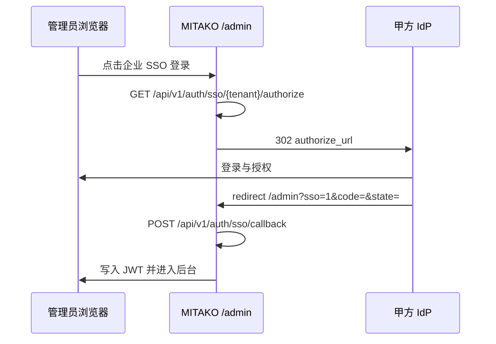

# 多租户 OIDC SSO 对接指南

适用版本：MITAKO Agent 当前客服与视觉审核 POC
适用对象：甲方 IT / 安全团队、我方实施与后端开发

## 1. 概述

MITAKO 支持按租户配置独立 OIDC IdP。生产或灰度环境应关闭本地演示 SSO，只通过甲方真实 IdP 完成授权码交换。

| 组件 | 说明 |
|---|---|
| 租户配置 | SQLite `auth.db` 的 `tenants` 表，生产可替换为正式配置中心 |
| OAuth state | Redis 优先；单实例开发可使用进程内回退 |
| 回调地址 | 推荐 `https://<域名>/admin?sso=1` |
| 角色映射 | `oidc_role_mapping_json`：IdP `groups` 映射到 MITAKO 角色 |

## 2. 甲方需提供的 IdP 信息

1. Issuer URL，例如 `https://login.company.com`。
2. Client ID / Client Secret。
3. Redirect URI，必须与 MITAKO 配置完全一致。
4. Scopes，至少 `openid profile email`；如需角色映射，需要提供 `groups` 或等价 claim。
5. UserInfo / Token 端点，如与标准发现地址不同需单独提供。
6. Groups / Roles claim 名称，默认读取 `groups`。

## 3. MITAKO 侧配置

```env
MITAKO_AUTH_REQUIRED=1
MITAKO_PROTECTED_API_AUTH_REQUIRED=1
MITAKO_JWT_SECRET=<随机强密钥>
MITAKO_SSO_DEMO=0
REDIS_HOST=<Redis 主机>
```

示例 SQL：

```sql
UPDATE tenants SET
  sso_enabled = 1,
  oidc_issuer = 'https://login.company.com',
  oidc_client_id = 'mitako-prod',
  oidc_client_secret = '<甲方提供的 secret>',
  oidc_redirect_uri = 'https://cs.company.com/admin?sso=1',
  oidc_scopes = 'openid profile email groups',
  oidc_role_mapping_json = '{"super_admin":["mitako-admin"],"supervisor":["mitako-supervisor"],"bpo_manager":["mitako-bpo"],"desk_agent":["mitako-desk"],"qc_viewer":["mitako-qc"]}'
WHERE tenant_id = 'mitako';
```

角色优先级：`super_admin` > `supervisor` > `bpo_manager` > `qc_viewer` > `desk_agent`。未匹配任何组时默认映射为 `desk_agent`。

## 4. 登录流程



## 5. 联调检查清单

- Redirect URI 已加入 IdP 白名单，并与 `oidc_redirect_uri` 完全一致。
- Client Secret 只写入部署环境或安全配置，不提交到代码仓库。
- Redis 可用，多 worker 共享 state。
- 测试账号 groups 能映射到预期角色。
- `MITAKO_SSO_DEMO=0` 时演示 SSO 不可用。
- JWT 中 `tenant_id` 与登录租户一致。

## 6. 常见问题

| 现象 | 处理 |
|---|---|
| `invalid_state` | state 过期、Redis 未共享或服务重启 |
| `oidc_not_configured` | issuer、client、secret 未完整配置 |
| `token_exchange_failed` | redirect URI 不一致或 code 已使用 |
| 登录后角色不对 | 检查 IdP groups claim 与 `oidc_role_mapping_json` |
