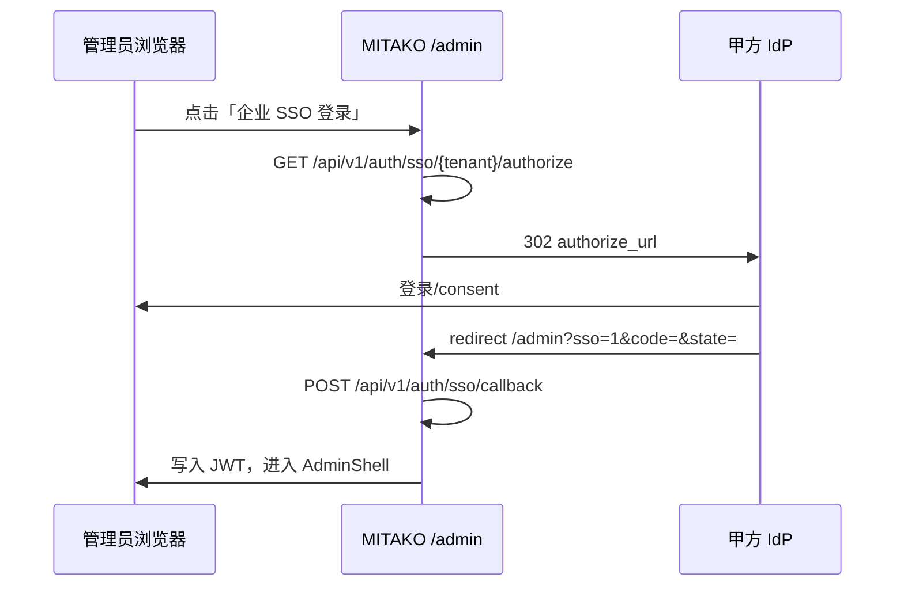

# 多租户 OIDC SSO 对接指南（甲方 IdP）

> 适用版本：MITAKO Agent 010 企业级生产 · 最后更新：2026-06

## 1. 概述

MITAKO 支持按 **租户（tenant）** 配置独立 OIDC IdP。生产环境 **默认关闭 Demo SSO**（`MITAKO_SSO_DEMO=0`），必须通过真实 IdP 完成授权码交换。

| 组件 | 说明 |
|------|------|
| 租户配置 | SQLite `data/auth.db` → `tenants` 表 |
| OAuth state | Redis 优先（`REDIS_HOST`），单实例开发可进程内回退 |
| 回调地址 | 推荐：`https://<你的域名>/admin?sso=1` |
| 角色映射 | `oidc_role_mapping_json` — IdP `groups` → MITAKO 角色 |

## 2. 甲方需提供的 IdP 信息

请甲方 IT / 安全团队提供：

1. **Issuer URL**（例如 `https://login.company.com`）
2. **Client ID / Client Secret**（机密客户端）
3. **Redirect URI**（必须与 MITAKO 配置完全一致）
4. **Scopes**：至少 `openid profile email`；若用 groups 映射角色，需额外开通 `groups` 或等价 claim
5. **UserInfo / Token 端点**（若与标准 `{issuer}/oauth/token` 不同，需单独提供 URL）
6. **Groups / Roles claim 名称**（默认读取 `groups`，可在 UserInfo 中返回）

## 3. MITAKO 侧配置步骤

### 3.1 环境变量（生产必设）

```env
MITAKO_AUTH_REQUIRED=1
MITAKO_JWT_SECRET=<随机长密钥，勿用默认值>
MITAKO_SSO_DEMO=0
REDIS_HOST=<Redis 主机>   # 多实例 / 生产强烈建议
```

### 3.2 写入租户（示例 SQL）

```sql
UPDATE tenants SET
  sso_enabled = 1,
  oidc_issuer = 'https://login.company.com',
  oidc_client_id = 'mitako-prod',
  oidc_client_secret = '<甲方提供的 secret>',
  oidc_redirect_uri = 'https://cs.company.com/admin?sso=1',
  oidc_scopes = 'openid profile email groups',
  oidc_role_mapping_json = '{"super_admin":["mitako-admin"],"desk_agent":["mitako-desk"],"companion_ops":["mitako-companion-ops"]}'
WHERE tenant_id = 'mitako';
```

### 3.3 角色映射规则

- IdP 返回的 `groups`（或 `roles`）与 JSON 中数组 **任一匹配** 即映射到对应 MITAKO 角色
- 多组同时匹配时按优先级：`super_admin` > `supervisor` > `bpo_manager` > `companion_ops` > `qc_viewer` > `desk_agent`
- 未匹配任何组时默认为 `desk_agent`

## 4. 登录流程



## 5. 联调检查清单

- [ ] Redirect URI 在 IdP 白名单中与 `oidc_redirect_uri` 完全一致
- [ ] Client Secret 已写入 `tenants.oidc_client_secret`（勿提交 git）
- [ ] Redis 可用且多 worker 共享 state
- [ ] 测试账号 groups 能映射到预期角色
- [ ] `MITAKO_SSO_DEMO=0` 时 Demo 按钮仅显示「企业 SSO 登录」并跳转 IdP
- [ ] JWT 中 `tenant_id` 与登录租户一致

## 6. 常见问题

| 现象 | 处理 |
|------|------|
| `invalid_state` | state 过期（10min）或 Redis 未共享 / 进程重启 |
| `oidc_not_configured` | issuer/client/secret 未完整配置 |
| `token_exchange_failed` | redirect_uri 不一致或 code 已使用 |
| 登录后角色不对 | 检查 IdP groups claim 与 `oidc_role_mapping_json` |

## 7. 本地 E2E（仅开发）

```env
MITAKO_SSO_DEMO=1
```

此时可使用 `/api/v1/auth/sso/demo/complete` 完成 Demo 回调，**禁止在生产开启**。
